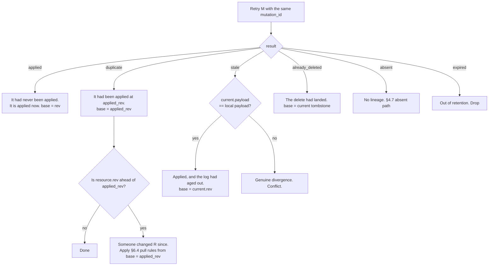
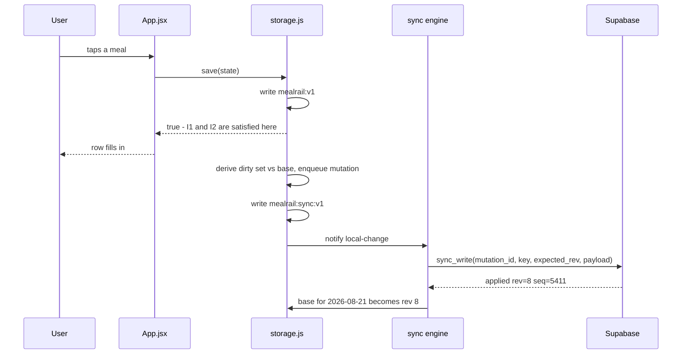
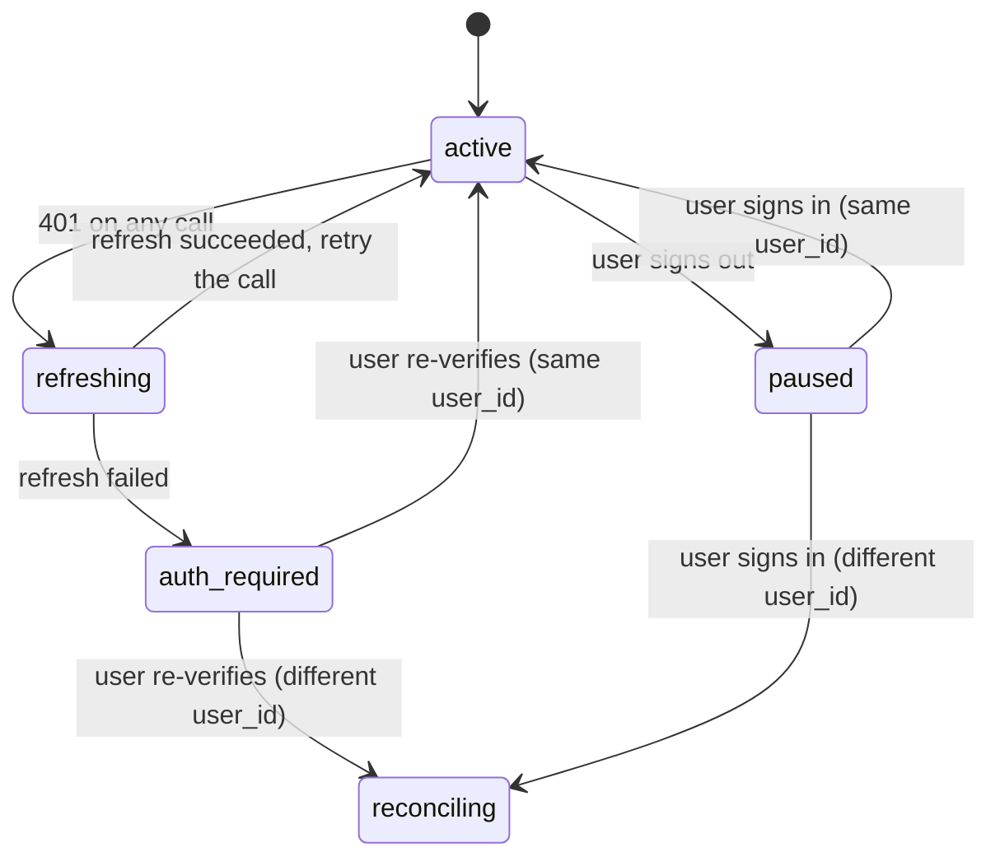
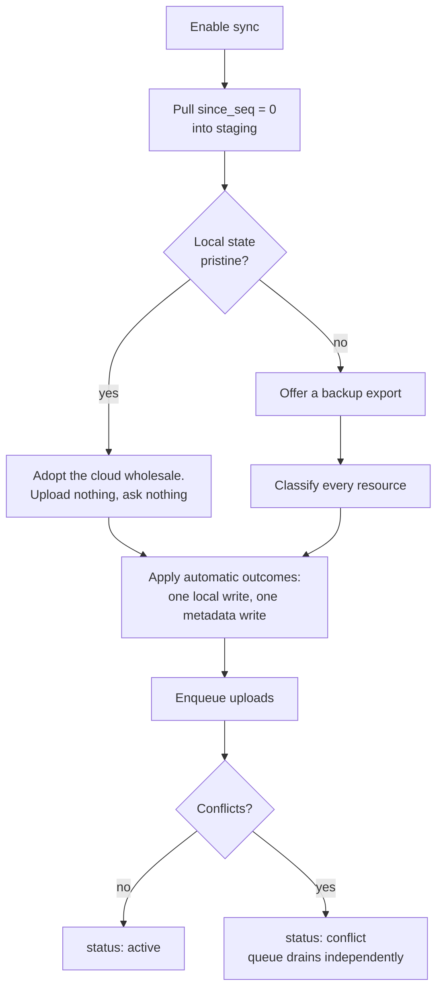

# Meal Rail sync protocol v1

Status: the sync contract for #63, written to close #64. Implemented by #65,
#66, #68, #69 and #70. Assumes #40 (dated meal plans) is shipped, which it is.

This document is a contract, not a proposal. Every decision the backend work in
#65 and the client work in #66, #68, #69 and #70 needs is made here. If those
issues find themselves inventing a conflict rule, an authority rule or a wire
shape, that is a bug in this document — raise it against #64 rather than
deciding locally, because the whole point of the contract is that two
independently written halves converge.

## 0. How to read this

- **MUST / MUST NOT / MAY** carry their usual weight. Anything phrased as
  "the client does X" is a MUST.
- Identifiers in `code` are literal wire names. Change one and both halves
  break.
- Paragraphs opening with **Why** record why a decision went the way it did, so
  a later change can tell a considered choice from an accident.
- Nothing here provisions Supabase, implements authentication, changes
  `storage.js`, or builds the engine or the conflict UI. It describes what those
  will do.

Five words are used precisely throughout and are easy to confuse:

| Term         | Meaning                                                                                                                            |
| ------------ | ---------------------------------------------------------------------------------------------------------------------------------- |
| **resource** | One independently revisioned unit: the settings, or one `YYYY-MM-DD` day.                                                          |
| **payload**  | The Meal Rail data inside a resource. The server never interprets it.                                                              |
| **envelope** | Payload plus server-owned metadata: revision, sequence, deletion flag, timestamps.                                                 |
| **base**     | The last server-confirmed envelope the client saw for a resource. Concurrency is measured against the base, never against a clock. |
| **dirty**    | Local payload differs from base payload. A dirty resource has a change the server has not confirmed.                               |

## 1. Goals, invariants, non-goals

### 1.1 Goals

1. Two devices signed into the same identity converge on the same set of days
   and the same settings, without either device losing a write the user was
   told had been saved.
2. Changes to different days, and changes to a day versus changes to settings,
   merge with no user involvement.
3. A day changed concurrently on two devices produces exactly one explicit
   choice, not a silent winner and not a partial merge.
4. Offline use is indistinguishable from online use at the point of the tap.
5. Every failure mode — offline, expired session, provider outage, rate limit,
   a lost success response, a device that has been away for a year — has one
   deterministic outcome that a test can assert.

### 1.2 Invariants

These are the guarantees the rest of the document exists to preserve. Every
rule below is checkable against this list.

| #   | Invariant                                                                                                                                                                       |
| --- | ------------------------------------------------------------------------------------------------------------------------------------------------------------------------------- |
| I1  | **Logging never waits for the network.** No user-visible interaction is gated on a request.                                                                                     |
| I2  | **Local before remote.** An accepted interaction is durable in `localStorage` before any sync work for it begins.                                                               |
| I3  | **Local-only is the default.** With sync off, the app behaves exactly as it does today, byte for byte, including the `mealrail:v1` key.                                         |
| I4  | **A network failure never rolls back a confirmed local write.** There is no path from a request outcome to discarding local data.                                               |
| I5  | **No value is discarded without confirmation.** Automatic resolution happens only where one side did not change, or where both sides are byte-identical after canonicalization. |
| I6  | **Server revisions decide concurrency.** No client clock, and no server clock, orders two writes.                                                                               |
| I7  | **`planned` is historical.** It is copied verbatim and never recomputed during sync. Grades are never persisted and never travel.                                               |
| I8  | **Deleted stays deleted.** A device that has been offline cannot resurrect a deleted day (§9.4 proves the bound).                                                               |
| I9  | **Leaving is not erasing.** Sign-out, disable and cloud-delete each retain the latest resolved local state.                                                                     |
| I10 | **Backups are independent of sync.** Export and import work in every sync state, and sync metadata never enters a backup file.                                                  |
| I11 | **No privileged credential in the browser.** The client holds a publishable key and a user session, nothing else.                                                               |

### 1.3 Non-goals for v1

Explicitly out of scope. Adding any of these is a protocol version bump, not a
patch.

- Realtime subscriptions, WebSockets, or push. Sync is pull-on-trigger.
- CRDTs, operational transforms, or field-level merge of any resource.
- Three-way merge or automatic conflict resolution by heuristic.
- Passwords, magic links, end-to-end encryption, or shared/multi-user accounts.
- Server-side grading, validation of Meal Rail semantics, or migration of
  payloads. The server stores payloads opaquely.
- Selective or partial sync. If sync is on, all resources sync.
- Attachments, images, or anything that is not JSON under the size caps in §2.3.

## 2. Model and constants

### 2.1 Resources

There are exactly two resource kinds.

| `kind`     | `key`                    | Cardinality | Deletable |
| ---------- | ------------------------ | ----------- | --------- |
| `settings` | the literal `"settings"` | exactly one | no        |
| `day`      | `YYYY-MM-DD` local date  | 0..n        | yes       |

A resource is addressed by the pair `(kind, key)`. The client's local shorthand
for that pair — used as a map key in sync metadata, in events and in conflict
records — is `settings` and `day:YYYY-MM-DD`. That shorthand never appears on
the wire.

`key` for `kind = "day"` MUST match `^\d{4}-\d{2}-\d{2}$` **and** name a real
calendar date. The server applies exactly the check `validDayKey` in
`storage.js` applies, because a key that the client would refuse to store must
not be storable in the cloud.

`key` for `kind = "settings"` MUST be the literal string `"settings"`.

**Why a non-null key for the singleton.** Uniqueness is enforced by a
`(user_id, kind, key)` constraint, and `null` does not participate in a unique
constraint the way a value does. A literal keeps one index, one code path and
one result shape for both kinds.

### 2.2 Versions

Three version numbers exist and they version different things. Conflating them
is the most likely way to break an installed PWA that has not been opened in
six months.

| Name               | Value in v1 | Versions                                                  | Who bumps it                                  |
| ------------------ | ----------- | --------------------------------------------------------- | --------------------------------------------- |
| `mealrail:v1`      | `v1`        | The local storage key and the backup file format.         | Nobody, for now. See §10.4.                   |
| `protocol_version` | `1`         | Envelope shape, operation names, arguments, result codes. | A change to how clients and the server talk.  |
| `payload_version`  | `1`         | The shape of the Meal Rail data inside a resource.        | A change to the day record or settings shape. |

`payload_version` 1 is the post-#40 shape: `settings.plans` exists,
`settings.slots` does not, and no day carries the legacy `training` flag. The
migrations in `storage.js` (`migratePlans`, `migrateDay`) run **before** a
payload is eligible for upload, so `payload_version` 0 never appears on the
wire.

### 2.3 Constants

| Constant                     | Value                | Where it lives        | Notes                                                                 |
| ---------------------------- | -------------------- | --------------------- | --------------------------------------------------------------------- |
| `PROTOCOL_VERSION`           | `1`                  | client + server       | Sent on every request.                                                |
| `PAYLOAD_VERSION`            | `1`                  | client                | Stored per row by the server, never interpreted by it.                |
| `LOCAL_STATE_KEY`            | `"mealrail:v1"`      | client                | Unchanged. Still the only place user data lives locally.              |
| `SYNC_META_KEY`              | `"mealrail:sync:v1"` | client                | New. Never enters a backup.                                           |
| `RETENTION_DAYS`             | `400`                | client (`src/day.js`) | Existing. Unchanged.                                                  |
| `WRITE_FLOOR_DAYS`           | `401`                | server                | Writes to day keys older than `current_date - 401` (UTC) are refused. |
| `GC_FLOOR_DAYS`              | `403`                | server                | Rows for day keys older than `current_date - 403` (UTC) are deleted.  |
| `TOMBSTONE_MIN_DAYS`         | `400`                | server                | A tombstone is additionally kept at least this long after deletion.   |
| `MUTATION_LOG_DAYS`          | `30`                 | server                | Idempotency records older than this are deleted. See §5.5.            |
| `PULL_PAGE_DEFAULT`          | `200`                | both                  | Rows per pull page.                                                   |
| `PULL_PAGE_MAX`              | `500`                | server                | Larger requests are clamped, not rejected.                            |
| `MAX_DAY_PAYLOAD_BYTES`      | `65536`              | server                | A real day is ~400 bytes. This is an abuse bound, not a budget.       |
| `MAX_SETTINGS_PAYLOAD_BYTES` | `262144`             | server                | Holds the whole dated-plan history.                                   |
| `BACKOFF_BASE_MS`            | `1000`               | client                | Full-jitter exponential backoff.                                      |
| `BACKOFF_MAX_MS`             | `300000`             | client                | Five minutes.                                                         |
| `RATE_LIMIT_FLOOR_MS`        | `30000`              | client                | Minimum wait after a 429 with no `Retry-After`.                       |
| `DEVICE_TOUCH_INTERVAL_H`    | `24`                 | client                | How often a device refreshes its own metadata row.                    |

## 3. Wire schemas

All JSON. All timestamps are ISO 8601 with an explicit `Z`. All revisions and
sequences are integers. `null` and an absent key mean the same thing everywhere
except where stated.

### 3.1 Canonical form

Two payloads that mean the same thing MUST serialize identically, or the client
will report a conflict between a day and itself. Canonicalization is a client
concern — the server stores whatever bytes it is given — but both halves of a
conflict are compared using it, so it is part of the contract.

To canonicalize a payload:

1. **Normalize** (§3.2, §3.3): drop optional keys whose value is empty. An
   absent `notes` and a `notes: {}` are the same day.
2. **Order keys** lexicographically by UTF-16 code unit at every object level.
3. **Preserve array order.** `plans[].slots`, `unplanned` and `workouts` are
   ordered; their order is data, not presentation.
4. **Serialize** with no whitespace, no trailing commas, integers as integers.

The result is the _canonical string_. Two comparisons use it:

- **Local vs remote** (is this really a conflict?) compares canonical strings
  directly. Both payloads are in hand, so the comparison is exact.
- **Local vs base** (is this resource dirty?) compares a 128-bit non-cryptographic
  hash of the canonical string, stored in sync metadata.

**Why a non-cryptographic hash.** `crypto.subtle` is undefined outside a secure
context, and a build served over the LAN to a phone — the way this app is
tested, and the reason `exportClipboard` keeps a selection-based fallback — is
exactly that. A synchronous, dependency-free 128-bit hash works everywhere the
app runs. It is only ever compared against a hash of the same client's own
earlier bytes; a collision would make a changed resource look clean, which the
next pull heals by rev comparison, and no decision that discards data depends
on it.

**Why not store the base payload.** `localStorage` is the constrained resource
and a shadow copy roughly doubles the blob. The hash answers the only question
the base is asked — "did this change?" — and the two questions that need real
bytes (is local identical to remote, and which do I keep) always have both real
payloads available.

### 3.2 Day payload

Byte-for-byte the day record already stored under `days["YYYY-MM-DD"]`, after
normalization. No field is added, renamed or reinterpreted for the wire.

```json
{
  "checks": {
    "s1": "2026-08-21T12:03:11.482Z",
    "s4": "2026-08-21T23:41:02.001Z"
  },
  "notes": { "s1": "eggs" },
  "unplanned": [
    { "id": "u1755", "t": "2026-08-21T15:12:00.000Z", "note": "biscuit" }
  ],
  "workouts": [{ "id": "w1755", "t": "2026-08-21T17:00:00.000Z" }],
  "drinks": 2,
  "planned": 4
}
```

| Field       | Type                      | Required | Normalization                                     |
| ----------- | ------------------------- | -------- | ------------------------------------------------- |
| `checks`    | `{ [slotId]: isoString }` | no       | Omitted when empty.                               |
| `notes`     | `{ [slotId]: string }`    | no       | Omitted when empty. Values are non-empty strings. |
| `unplanned` | `[{ id, t, note? }]`      | no       | Omitted when empty. Order preserved.              |
| `workouts`  | `[{ id, t, note? }]`      | no       | Omitted when empty. Order preserved.              |
| `drinks`    | non-negative integer      | no       | Omitted when `0`.                                 |
| `planned`   | non-negative integer      | no       | **Never synthesized.** Copied verbatim or absent. |

**`planned` is optional and is never computed during sync.** A record written
before `planned` existed has no `planned`, and the wire keeps it that way. Every
client resolves an absent `planned` identically at render time, via
`slotsFor(plans, key).length` — and `plans` is itself synced, so the resolution
agrees across devices without the number ever being written down. Synthesizing
it at upload time would bake the _uploading device's current plan_ into history,
which is precisely the re-grading that #63 forbids (I7).

The `id` values in `unplanned` and `workouts` are client-generated and are only
required to be unique within their own array on their own day. They are not
resource identifiers and the server does not index them.

### 3.3 Settings payload

The local `settings` object minus the device-local keys.

```json
{
  "plans": [
    {
      "from": "2026-01-01",
      "slots": [
        { "id": "s1", "label": "Breakfast" },
        { "id": "s2", "label": "Lunch" },
        { "id": "s4", "label": "Dinner" }
      ]
    },
    {
      "from": "2026-06-14",
      "slots": [
        { "id": "s1", "label": "Breakfast" },
        { "id": "s4", "label": "Dinner" },
        { "id": "s5", "label": "Supper" }
      ]
    }
  ],
  "trainingEnabled": true,
  "promptNotes": false,
  "stripMark": "boxes",
  "stripGrade": "badge"
}
```

Normalization:

- `plans` MUST be sorted ascending by `from` with no duplicate `from`. This is
  already what `upsertPlan` produces, so canonical order is the stored order.
- `slots` order is preserved — it is the order of the rail.
- Every other key of `settings` is carried through as-is, **except** the
  device-local denylist.

```js
const DEVICE_LOCAL_SETTINGS = ["lastBackupAt"];
```

**Why a denylist rather than an allowlist.** `App.jsx` never rebuilds
`settings` from scratch; `patchSettings` spreads it. So an unknown key written
by a newer release survives an older release's edits locally, and a denylist
makes it survive the round trip through the cloud too. An allowlist would have
an older device silently strip a newer device's setting on every write. The
cost is that a _future_ device-local key must ship in the denylist before the
setting that needs it, or it will sync for one release. Adding a device-local
setting is therefore a `payload_version` bump (§10.2).

**Why `lastBackupAt` is device-local.** It answers "when did I last take a
backup _from this device_". Syncing it would let a laptop's export tell a phone
that its own data is backed up, which is the one thing that line is there to
prevent. It stays in the local `settings` object and in exported backups; it is
stripped on upload and preserved on download.

### 3.4 Envelope

What every operation returns for a resource.

```json
{
  "kind": "day",
  "key": "2026-08-21",
  "rev": 7,
  "seq": 5310,
  "deleted": false,
  "payload_version": 1,
  "payload": { "checks": { "s1": "2026-08-21T12:03:11.482Z" }, "planned": 4 },
  "created_at": "2026-08-21T12:03:12.004Z",
  "updated_at": "2026-08-21T17:04:11.238Z",
  "deleted_at": null,
  "updated_by": "8f2a1c4e-1d33-4f0a-9a72-6c9a0b21e7d5"
}
```

| Field             | Type             | Notes                                                                |
| ----------------- | ---------------- | -------------------------------------------------------------------- |
| `kind`, `key`     | string           | Resource address (§2.1).                                             |
| `rev`             | integer ≥ 1      | Per-resource revision. See §5.                                       |
| `seq`             | integer ≥ 1      | Per-user monotonic sequence. Pull cursor only. See §5.2.             |
| `deleted`         | boolean          | `true` makes this envelope a tombstone.                              |
| `payload_version` | integer ≥ 1      | The shape of `payload`. `null` on a tombstone.                       |
| `payload`         | object or `null` | Always `null` when `deleted` is `true`.                              |
| `created_at`      | ISO timestamp    | Display and diagnostics only.                                        |
| `updated_at`      | ISO timestamp    | Display and diagnostics only. **Never** used to order anything (I6). |
| `deleted_at`      | ISO or `null`    | When the tombstone was created. Drives tombstone retention (§9.4).   |
| `updated_by`      | UUID or `null`   | The `device_id` that wrote this revision. Advisory. See §3.6.        |

### 3.5 Tombstone

A tombstone is an envelope, not a separate type. It occupies the same row, keeps
the same `rev` lineage, and is returned by pull like any other change.

```json
{
  "kind": "day",
  "key": "2026-08-21",
  "rev": 8,
  "seq": 5402,
  "deleted": true,
  "payload_version": null,
  "payload": null,
  "created_at": "2026-08-21T12:03:12.004Z",
  "updated_at": "2026-08-22T09:15:00.117Z",
  "deleted_at": "2026-08-22T09:15:00.117Z",
  "updated_by": "8f2a1c4e-1d33-4f0a-9a72-6c9a0b21e7d5"
}
```

A tombstone is distinguishable from a resource that never existed: pull returns
the tombstone, and a create against a tombstone is refused with `deleted`
(§4.3), whereas a resource that never existed has no row and a create succeeds.
This distinction is what makes I8 enforceable.

Undelete is legal: `sync_write` with `expected_rev` equal to the tombstone's
`rev` clears `deleted`, sets a new payload and produces `rev + 1`. That is how
"keep this device" resolves a delete/update conflict (§8.4).

`kind = "settings"` has no delete operation and can never be tombstoned.

### 3.6 Device identity

```json
{
  "device_id": "8f2a1c4e-1d33-4f0a-9a72-6c9a0b21e7d5",
  "label": "iPhone",
  "platform": "ios-safari",
  "first_seen_at": "2026-03-02T08:11:00.000Z",
  "last_seen_at": "2026-08-22T09:15:00.117Z"
}
```

- `device_id` is a UUIDv4 generated once per browser profile on the first sync
  enablement and stored in `SYNC_META_KEY`. It survives sign-out and sign-in;
  it does not survive clearing site data, which is correct — that is a new
  browser profile as far as anything here can tell.
- `label` is user-editable and defaults to a coarse guess from the user agent.
  It is shown in conflict resolution ("changed on iPhone") and in nothing else.
- **Device identity is advisory and is never authority.** No rule anywhere in
  this document reads `device_id` to decide an outcome. A hostile or buggy
  client can send any `device_id` and the worst result is a misleading label in
  a conflict dialog. Ownership comes from `auth.uid()` and nothing else (§4.1).
- `device_id` is stripped from `updated_by` in the conflict UI when it names a
  device row the client has never seen, rather than shown as a raw UUID.

### 3.7 Client base revisions and base snapshots

Held in `SYNC_META_KEY`, one entry per resource the client has ever confirmed:

```json
"base": {
  "settings": { "rev": 12, "seq": 5290, "hash": "3f9c…", "deleted": false, "payloadVersion": 1 },
  "day:2026-08-21": { "rev": 7, "seq": 5310, "hash": "a107…", "deleted": false, "payloadVersion": 1 },
  "day:2026-08-19": { "rev": 8, "seq": 5402, "hash": null, "deleted": true, "payloadVersion": null }
}
```

The **base snapshot** for a resource is the last server-confirmed payload. For a
clean resource the local payload _is_ the base snapshot — they are equal by
definition — so only its `hash` is stored. For a dirty resource the base payload
is not retained; §3.1 explains why, and §5.4 shows that no decision needs it.

A base entry with `deleted: true` is a **local tombstone marker**: the client
knows the day is deleted in the cloud and knows at which revision. It is what
stops a create from being re-derived for a day the user has already removed, and
it is dropped only when the resource is recreated or when local retention passes
the key (§9.5).

### 3.8 Pending mutations and idempotency

```json
"pending": [
  {
    "mutationId": "d0b2b7de-6b1c-4a94-8d51-0f43a9b2c1aa",
    "kind": "day",
    "key": "2026-08-21",
    "op": "write",
    "expectedRev": 7,
    "payloadVersion": 1,
    "payloadHash": "b442…",
    "state": "queued",
    "queuedAt": "2026-08-21T17:04:09.900Z",
    "attempts": 0,
    "nextAttemptAt": null,
    "dirtyAgain": false,
    "recreatedOnce": false,
    "lastError": null
  }
]
```

Rules, all of them load-bearing:

- **`mutationId` is a UUIDv4 minted when the mutation is enqueued** and reused
  for every retry of that mutation. It is the idempotency key (§5.5).
- **At most one pending entry per resource.** Enqueueing a change for a resource
  that already has a `queued` entry replaces it and mints a **new**
  `mutationId`, because the payload it describes has changed.
- **A `queued` entry does not store the payload.** The payload is re-derived
  from `LOCAL_STATE_KEY` at send time, so what is pushed is always current local
  truth and the user's data is never duplicated into a second key.
- **`payloadHash` is the invariant that makes that safe.** At send time the
  client re-derives the canonical payload and compares its hash. A mismatch means
  the previous rule was violated; the client MUST mint a new `mutationId` before
  sending. Sending a changed payload under an already-applied `mutationId` would
  have the server answer `duplicate` for a write that never happened — the one
  way this design could lose a write.
- **A change to a resource whose entry is `inflight` sets `dirtyAgain`.** The
  in-flight request is allowed to settle; a fresh mutation is derived afterwards
  against the new base. Two mutations for one resource are never in flight at
  once, so two writes can never race for the same `expectedRev`.
- **`recreatedOnce`** guards the `absent` recovery path in §4.7 against a loop.
- The queue survives reload and is replayed in order. Order across resources is
  preserved but is not semantically required: resources are independent.

## 4. Operations

### 4.1 Transport and authorization

Every operation is a Postgres function called through PostgREST, i.e.
`supabase.rpc(name, args)` against `POST /rest/v1/rpc/<name>`. The browser holds
a publishable key (`sb_publishable_…`, the successor to the legacy `anon` key)
and a user access token from Supabase Auth. No secret key, no `service_role`
key, and no server-side proxy is involved (I11).

Three authorization rules, in order of importance:

1. **No operation takes a user id.** Ownership is derived inside the function
   from `(select auth.uid())`. A client-supplied user id is not merely ignored;
   the argument does not exist.
2. **Every sync function is `SECURITY INVOKER`** with `SET search_path = ''` and
   fully schema-qualified names. Row-level security on the underlying tables is
   the only authorization mechanism, so a mistake in a function cannot widen
   access beyond what the caller already has. #65's "database functions that
   bypass normal caller permissions are avoided" is satisfied by there being
   none on the client-exposed surface. The one place elevated privilege is
   needed is the scheduled retention job (§9.6), which is not reachable from a
   browser.
3. **`anon` gets nothing.** `EXECUTE` on every sync function and all privileges
   on every sync table are revoked from `anon` and `public` and granted only to
   `authenticated`.

**Why RPC rather than PostgREST table verbs.** A `PATCH …?key=eq.X&rev=eq.7`
with `Prefer: return=representation` is an atomic compare-and-swap, but a
zero-row response cannot say whether the resource is stale, tombstoned, absent,
or outside retention — and those four need four different client behaviours
(§4.7). A function returns a discriminated result and does the revision
increment, the sequence stamp and the idempotency lookup in the same
transaction.

### 4.2 Result envelope

Every operation returns **HTTP 200** with one of these bodies. Protocol
outcomes are values, not HTTP errors.

```json
{ "ok": true,  "protocol": 1, "server_time": "2026-08-21T17:04:11.300Z", "result": "applied", "resource": { … } }
{ "ok": false, "protocol": 1, "server_time": "…", "result": "stale", "current": { … } }
```

| `result`               | `ok`  | Carries                   | Meaning                                                                |
| ---------------------- | ----- | ------------------------- | ---------------------------------------------------------------------- |
| `applied`              | true  | `resource`                | The mutation was applied and produced `resource.rev`.                  |
| `duplicate`            | true  | `resource`, `applied_rev` | This `mutation_id` had already been applied, at `applied_rev`.         |
| `already_deleted`      | true  | `resource`                | A delete whose target is already a tombstone at `expected_rev`. No-op. |
| `stale`                | false | `current`                 | `expected_rev` does not match. `current` is the live envelope.         |
| `deleted`              | false | `current`                 | A create (`expected_rev: 0`) whose target is a tombstone.              |
| `absent`               | false | `current: null`           | `expected_rev > 0` but no row exists at all.                           |
| `expired`              | false | `floor`                   | Day key older than the write floor (§9.2).                             |
| `invalid`              | false | `field`, `detail`         | Malformed argument. Never retried.                                     |
| `too_large`            | false | `limit`, `size`           | Payload over the cap in §2.3. Never retried.                           |
| `unsupported_protocol` | false | `supported: [1]`          | `p_protocol` is not one this server speaks.                            |

**Why protocol outcomes are HTTP 200.** `stale` must carry the current envelope;
supabase-js surfaces a non-2xx as `error`, where the body is a message string
rather than typed data. And a `409` from the function is indistinguishable at
the client from a `409` produced by a proxy, a CDN or a rate limiter. PostgREST
_can_ return a chosen status — `raise sqlstate 'PGRST' using detail =
json_build_object('status', 409, …)` is the documented mechanism — and it is
deliberately not used here. The split is: **transport, authentication and infra
use HTTP status; the protocol uses `result`.**

HTTP statuses the client must still handle, none of which are protocol
outcomes:

| Status                        | Cause                                                             | Client behaviour                                                |
| ----------------------------- | ----------------------------------------------------------------- | --------------------------------------------------------------- |
| network error / no response   | Offline, DNS, TLS, timeout                                        | Backoff retry. Status `offline` if `navigator.onLine` is false. |
| `401` (`PGRST301`/`PGRST303`) | JWT invalid, undecodable, or claims failed — in practice, expired | Attempt one silent refresh, then §6.5.                          |
| `403` / SQLSTATE `42501`      | Grant or RLS refusal. A bug or a revoked session.                 | Stop. Status `failed`. Never retried silently.                  |
| `429`                         | Rate limit                                                        | Honour `Retry-After`, else `RATE_LIMIT_FLOOR_MS`.               |
| `5xx`                         | Provider outage                                                   | Backoff retry.                                                  |

### 4.3 `sync_pull` — initial fetch and incremental pull

There is no separate "full fetch". A full fetch is `p_since_seq = 0`.

**Request**

```json
{ "p_protocol": 1, "p_since_seq": 5290, "p_limit": 200 }
```

**Success**

```json
{
  "ok": true,
  "protocol": 1,
  "server_time": "2026-08-21T17:04:11.300Z",
  "result": "page",
  "rows": [ { …envelope… }, { …envelope… } ],
  "next_seq": 5402,
  "has_more": false,
  "write_floor": "2025-07-16",
  "account": { "user_id": "…", "created_at": "…" }
}
```

- `rows` are the **current** envelopes of every resource with `seq > p_since_seq`,
  ordered by `seq` ascending, at most `min(p_limit, PULL_PAGE_MAX)` of them.
  A resource that changed five times appears once, at its latest `seq`. Pull is
  a changed-resource feed, not an event log.
- **Tombstones are always included.** There is no option to exclude them; a
  device enabling sync with existing local data is exactly the case that needs
  them (§7.4).
- `next_seq` is the highest `seq` in the page, or `p_since_seq` when the page is
  empty.
- `has_more` is `true` when the page was truncated. The client loops
  immediately, it does not wait for the next trigger.
- `write_floor` is the server's current day-key write floor (§9.2), so the
  client can drop doomed pending mutations without a round trip.

**Paging is safe over a mutating table.** `seq` only ever increases, so no row
can move backwards past a cursor the client has already passed. A row that
changes mid-paging either has not been read yet (it will be read at its new
`seq`) or has been read and is re-delivered on a later page (applying an
envelope is idempotent — last-writer-by-`rev`). Cross-page inconsistency is
harmless because each envelope is self-describing and applied per resource.

**The cursor advances only after the page is durable.** The client writes
applied state to `LOCAL_STATE_KEY`, then `next_seq` to `SYNC_META_KEY`. A crash
between the two re-delivers the page, which is a no-op.

Failure results: `unsupported_protocol`, `invalid`. Everything else is a
transport failure.

### 4.4 `sync_write` — create, update and undelete

One function for all three, because they are one compare-and-swap with
different `expected_rev` values.

**Request**

```json
{
  "p_protocol": 1,
  "p_mutation_id": "d0b2b7de-6b1c-4a94-8d51-0f43a9b2c1aa",
  "p_device_id": "8f2a1c4e-1d33-4f0a-9a72-6c9a0b21e7d5",
  "p_kind": "day",
  "p_key": "2026-08-21",
  "p_expected_rev": 7,
  "p_payload_version": 1,
  "p_payload": { "checks": { "s1": "2026-08-21T12:03:11.482Z" }, "planned": 4 }
}
```

`p_expected_rev` semantics:

| Value | Means                                         | Server state that satisfies it            |
| ----- | --------------------------------------------- | ----------------------------------------- |
| `0`   | "I believe this resource does not exist."     | No row.                                   |
| `n>0` | "I believe this resource is at revision `n`." | Row at `rev = n`, live **or** tombstoned. |

**Outcomes**

| Server state               | `p_expected_rev` | Result                                    |
| -------------------------- | ---------------- | ----------------------------------------- |
| mutation id already in log | any              | `duplicate` + `applied_rev` + current row |
| no row                     | `0`              | `applied`, new row at `rev: 1`            |
| no row                     | `n > 0`          | `absent`                                  |
| live row at `rev = n`      | `n`              | `applied`, `rev: n+1`                     |
| live row at `rev ≠ n`      | any              | `stale` + `current`                       |
| tombstone at `rev = n`     | `n`              | `applied` (undelete), `rev: n+1`          |
| tombstone at any rev       | `0`              | `deleted` + `current`                     |
| tombstone at `rev ≠ n`     | `n > 0`          | `stale` + `current`                       |
| day key < write floor      | any              | `expired` + `floor`                       |
| payload over cap           | any              | `too_large`                               |

**Applied writes, in one transaction:**

1. `insert into sync_accounts(user_id) values ((select auth.uid())) on conflict do nothing`
2. `update sync_accounts set seq = seq + 1 … returning seq` — takes the row lock
   that makes `seq` gapless-in-visibility (§5.2).
3. Upsert the resource row: `rev = rev + 1` (or `1`), `seq` from step 2,
   `deleted = false`, `payload`, `payload_version`, `updated_at = now()`,
   `updated_by = p_device_id`, `deleted_at = null`.
4. Insert the idempotency record (§5.5).
5. Return the new envelope.

**Validation the server performs.** Only what RLS, retention and storage
integrity require: `kind` in the known set, `key` well-formed for its kind,
`p_payload` a non-null JSON object, `p_payload_version ≥ 1`, size under the cap.
The server does **not** validate Meal Rail semantics — it does not know what a
slot is, does not check that `planned` is consistent, and does not grade
anything. A payload migration must never require a database migration (§10.1).

### 4.5 `sync_delete` — compare-and-swap tombstone

**Request**

```json
{
  "p_protocol": 1,
  "p_mutation_id": "…",
  "p_device_id": "…",
  "p_kind": "day",
  "p_key": "2026-08-21",
  "p_expected_rev": 7
}
```

**Outcomes**

| Server state               | `p_expected_rev` | Result                                    |
| -------------------------- | ---------------- | ----------------------------------------- |
| mutation id already in log | any              | `duplicate` + `applied_rev` + current row |
| live row at `rev = n`      | `n`              | `applied`, tombstone at `rev: n+1`        |
| live row at `rev ≠ n`      | any              | `stale` + `current`                       |
| tombstone at `rev = n`     | `n`              | `already_deleted`, **no revision bump**   |
| tombstone at `rev ≠ n`     | `n`              | `stale` + `current`                       |
| no row                     | any              | `absent`                                  |
| `p_expected_rev = 0`       | —                | `invalid` (a delete must name a revision) |
| `p_kind = "settings"`      | —                | `invalid` (settings cannot be deleted)    |
| day key < write floor      | any              | `expired`                                 |

**Why `already_deleted` does not bump the revision.** The desired end state
already holds. Bumping would push a content-free revision to every other device
and, for a client whose idempotency record had aged out, would make a retried
delete look like a fresh change. Returning the existing tombstone is both the
truthful answer and the quiet one.

### 4.6 `sync_touch_device` and `sync_purge`

```json
// sync_touch_device — upsert this device's advisory metadata.
{ "p_protocol": 1, "p_device_id": "…", "p_label": "iPhone", "p_platform": "ios-safari" }
→ { "ok": true, "result": "applied", "device": { …§3.6… } }
```

Called on successful sign-in and at most once every `DEVICE_TOUCH_INTERVAL_H`
hours on a foreground sync. It never blocks a pull or a push and its failure is
never surfaced.

```json
// sync_purge — delete the cloud copy. Used by #70.
{ "p_protocol": 1, "p_confirm": "DELETE" }
→ { "ok": true, "result": "purged", "removed": { "resources": 412, "mutations": 19, "devices": 3 } }
```

`sync_purge` deletes every resource row (live and tombstoned), every idempotency
record, every device row and the account counter row for `auth.uid()`. It does
not delete the Auth user — that is account deletion, a different action, owned
by #71.

`p_confirm` must be the literal `"DELETE"`; anything else returns `invalid`. The
reauthentication gate for this action is a client-side requirement on #70 and
#67 (a fresh OTP verification immediately before the call). **A server-side
freshness check is not specified in v1** and is listed in §14 as a hardening
item for #71: the obvious candidate is a recency assertion over the session's
authentication-method claims, and it should be verified against Supabase's
current JWT claim documentation before being relied on rather than assumed here.

Local state is untouched by `sync_purge`. Deleting the cloud copy and erasing
local history are separate actions and neither implies the other (I9).

### 4.7 Client behaviour per result

The complete mapping. Every branch is deterministic and testable.

| Result                  | Client action                                                                                                                                                                                                                                                                                                     |
| ----------------------- | ----------------------------------------------------------------------------------------------------------------------------------------------------------------------------------------------------------------------------------------------------------------------------------------------------------------- |
| `applied`               | Set base to the returned envelope. Drop the pending entry. If `dirtyAgain`, derive a fresh mutation against the new base.                                                                                                                                                                                         |
| `duplicate`             | Our mutation landed at `applied_rev`. Set base to `applied_rev`. Drop the pending entry. Then treat `resource` as a freshly pulled envelope — if its `rev > applied_rev`, §6.4 decides between fast-forward and conflict.                                                                                         |
| `already_deleted`       | Set base to the returned tombstone. Drop the pending entry.                                                                                                                                                                                                                                                       |
| `stale`                 | Compare `current.payload` to the local canonical payload. **Identical** → adopt `current.rev` as base, drop the pending entry, no conflict. **Different** → raise a conflict (§8) with `remote = current` and `base = the pending entry's expectedRev`. Drop the pending entry; the conflict now owns the change. |
| `deleted`               | Raise a `local-vs-tombstone` conflict (§8.4). Never auto-create over a tombstone (I8).                                                                                                                                                                                                                            |
| `absent`                | The server has no lineage. If `recreatedOnce` is false, drop the base entry, set `recreatedOnce`, and re-enqueue as a create (`expectedRev: 0`) under a new `mutationId`. Otherwise surface as `failed`.                                                                                                          |
| `expired`               | Drop the pending entry and the base entry. Trim the day locally on the next save. No user-visible failure: the day was already out of retention.                                                                                                                                                                  |
| `invalid` / `too_large` | Permanent. Drop the pending entry, keep the local data, surface status `failed` with the resource named. Never retried, never silently dropped.                                                                                                                                                                   |
| `unsupported_protocol`  | Stop all sync. Status `failed` with copy directing the user to update the app (§10.3).                                                                                                                                                                                                                            |

## 5. Revision semantics

### 5.1 `rev` — per-resource, compare-and-swap

- Assigned by the server. Never by a client.
- First accepted write for a resource produces `rev = 1`.
- Every accepted mutation — update, delete, undelete, conflict resolution —
  produces `rev + 1`.
- `already_deleted` produces no new revision (§4.5). It is the only accepted
  outcome that does not.
- Revisions are never reused. Hard deletion by retention (§9.6) removes the row
  and its lineage; if the same day key is later created again it starts at
  `rev = 1`, which is safe because no client can hold a base for a key past the
  write floor (§9.4).
- **A stale write changes nothing.** The row is untouched, no `seq` is consumed,
  and no idempotency record is written. Retrying a stale mutation is
  deterministic: it will be stale again.

### 5.2 `seq` — per-user, cursor only

`seq` exists because `rev` cannot order changes _across_ resources, and a pull
cursor needs a total order.

- One `bigint` counter per user, stored on the account row.
- Every accepted mutation increments it and stamps the result onto the resource
  row. `seq` therefore increases monotonically across all of a user's resources.
- **`seq` is never used for concurrency.** It never appears in a request. It is
  the pull cursor and nothing else.

**Why a counter row and not a sequence.** `nextval` hands out numbers without
serializing commits: transaction B can take `seq = 10` and commit while
transaction A still holds `seq = 9` uncommitted. A pull between those two
commits would read `seq = 10`, advance its cursor past 9, and never see A's
change — a silent lost update, exactly the failure this protocol exists to
prevent. Incrementing a counter row takes a row lock held to commit, so B cannot
obtain `seq = 10` until A has committed `seq = 9`. If `seq = n` is visible,
every `seq < n` is committed. The cost is that one user's writes serialize,
which for one person and a handful of devices is not a cost.

Gaps in `seq` (from a rolled-back transaction) are harmless: the cursor is
`seq > n`, never `seq = n + 1`.

### 5.3 What is _not_ a revision

- `updated_at` and `created_at` are display strings. Nothing orders by them.
- `server_time` is returned so the client can show "last synced" honestly
  without trusting the device clock. It participates in no decision.
- Client clocks appear in the data — `checks` values are ISO timestamps — but
  they are payload, not metadata. Two devices with badly skewed clocks produce a
  conflict, not a silent reorder.

### 5.4 Stale writes

A write is stale when `expected_rev` does not match the server. The server
answers with the live envelope, and §4.7 turns that into one of exactly two
outcomes:

1. **`current.payload` is canonically identical to the local payload.** Somebody
   — another device, or this device's own earlier attempt whose response was
   lost and whose idempotency record has aged out — already wrote precisely what
   we wanted. Adopt `current.rev` as base. No conflict, no user involvement, no
   write.
2. **They differ.** Conflict.

Rule 1 is load-bearing: it is what makes the idempotency log an optimization
rather than a correctness requirement for the single-change case, and it is what
makes a lost sync-metadata write (§11.5) degrade to a wasted round trip instead
of a spurious conflict.

Rule 1 is _not_ sufficient on its own, which is why §5.5 exists. If a second
local change lands between the lost response and the retry, the local payload no
longer matches what was written, and without an idempotency record the client
would raise a conflict against its own earlier write.

### 5.5 Idempotency: distinguishing a lost response from a mutation that never happened

The server keeps a mutation log:

```
sync_mutations(user_id, mutation_id uuid, kind, key, op, applied_rev, applied_seq, applied_at)
primary key (user_id, mutation_id)
```

- **Only accepted mutations are recorded.** Rejections (`stale`, `deleted`,
  `absent`, `expired`, `invalid`) are deterministic and cheap to recompute; a
  record of every conflict would be pure growth.
- On any `sync_write` or `sync_delete`, the log is consulted first, in the same
  transaction as the write. A hit returns `duplicate` with `applied_rev` (what
  _this mutation_ produced) and `resource` (what the resource is _now_). Those
  two can differ, and the client needs both: `applied_rev` tells it its write
  landed and at which revision; `resource` tells it what has happened since.
- Records older than `MUTATION_LOG_DAYS` are deleted.

**The decision procedure for a lost response.** A mutation `M` for resource `R`
with `expected_rev = E` was sent and no response arrived. The client retries the
identical request, same `mutation_id`, and reads the result:



Every leaf is a defined state. There is no branch where the client must guess.

**Why the log is needed at all**, given rule 1 of §5.4. Consider: push day `D`
at `expected_rev = 3`; the response is lost; the user then unchecks a meal, so
local `D` changes. Without a log, the retry is stale, the payloads differ, and
the client raises a conflict between the user's own two consecutive edits. With
a log, the retry answers `duplicate` at `applied_rev = 4`, the client sets base
to 4, and the second edit is pushed cleanly at `expected_rev = 4`. That case is
the whole justification.

**After `MUTATION_LOG_DAYS`.** A pending mutation older than thirty days means a
device was offline for a month. Retrying is still safe — it either applies (rev
unchanged) or is stale, and stale resolves by §5.4 into adopt-or-conflict. The
only thing lost is the ability to distinguish a duplicate silently, and a
conflict is the correct conservative answer when the client genuinely cannot
tell. The client does **not** expire its own pending mutations; dropping one
would be dropping a confirmed local write (I4).

## 6. Authority and transition rules

"Authority" here means: after this transition, which side's bytes are the ones
the user keeps. In every row of every table below, the answer to "is any
confirmed local write discarded?" is no.

### 6.1 The one shape every local write has



The user's tap is answered before the engine is told anything. Everything to the
right of the `true` can fail, retry, or never happen; none of it can walk back
the row that filled in.

### 6.2 Local writes

| Transition                                     | Authority          | Rule                                                                                                                                                                                                       |
| ---------------------------------------------- | ------------------ | ---------------------------------------------------------------------------------------------------------------------------------------------------------------------------------------------------------- |
| Successful local write, online                 | Local, immediately | `save()` returns before any request. A mutation is enqueued at `expected_rev = base.rev` and pushed.                                                                                                       |
| Successful local write, offline                | Local, immediately | Identical path. The mutation sits `queued`; base is unchanged. Nothing about the write differs from the online case.                                                                                       |
| `save()` fails (quota, private mode)           | Nothing changed    | No mutation is enqueued. Existing behaviour: `saveError` on the status line. Sync must not paper over a failed local save.                                                                                 |
| Rapid consecutive writes                       | Last invocation    | Saves are serialized (§11.4). Consecutive pending saves coalesce into the latest snapshot; the dirty set is derived once against base, so a create-then-delete inside one coalescing window emits nothing. |
| Write to a resource with an in-flight mutation | Local              | `dirtyAgain` is set; the in-flight mutation settles first, then a fresh mutation is derived against the new base (§3.8).                                                                                   |
| Retention trims a day locally                  | Neither            | **No tombstone is emitted.** See §9.5 — this is the single most dangerous rule to get wrong.                                                                                                               |

### 6.3 Push outcomes

Covered exhaustively in §4.7. In summary: `applied`, `duplicate` and
`already_deleted` advance the base; `stale` either adopts (identical payload) or
becomes a conflict; `deleted` becomes a conflict; everything else drops the
mutation while keeping the local data.

### 6.4 Pull outcomes

For each envelope in a pulled page, given the local base and local state:

| Local state                                                            | Remote envelope                                      | Outcome                                                                                                                                   |
| ---------------------------------------------------------------------- | ---------------------------------------------------- | ----------------------------------------------------------------------------------------------------------------------------------------- |
| clean, `remote.rev > base.rev`                                         | live                                                 | **Fast-forward.** Replace local payload, set base. No user involvement.                                                                   |
| clean, `remote.rev > base.rev`                                         | tombstone                                            | **Fast-forward delete.** Remove the day locally, set base to the tombstone.                                                               |
| clean, `remote.rev == base.rev`                                        | either                                               | No-op.                                                                                                                                    |
| dirty, `remote.rev == base.rev`                                        | either                                               | No-op. Our pending push is still valid.                                                                                                   |
| dirty, `remote.rev > base.rev`, payload canonically identical to local | live                                                 | Adopt `remote.rev` as base, drop the pending mutation. Not a conflict.                                                                    |
| dirty, `remote.rev > base.rev`, payload differs                        | live                                                 | **Conflict** `update/update`.                                                                                                             |
| dirty, `remote.rev > base.rev`                                         | tombstone                                            | **Conflict** `update/delete`.                                                                                                             |
| locally deleted (pending delete), `remote.rev > base.rev`              | live                                                 | **Conflict** `delete/update`.                                                                                                             |
| locally deleted (pending delete)                                       | tombstone                                            | Adopt. Drop the pending delete.                                                                                                           |
| no base entry, no local data                                           | live                                                 | Adopt. (New day from another device.)                                                                                                     |
| no base entry, no local data                                           | tombstone                                            | Record the base tombstone marker. Nothing to delete.                                                                                      |
| no base entry, local data exists                                       | live or tombstone                                    | **This is initial reconciliation, not a pull.** See §7. Outside the first sync it means the base map was lost; §7 handles it identically. |
| any                                                                    | `payload_version` above what this client understands | **Quarantine** (§10.3). Never overwritten, never conflicted, shown read-only.                                                             |
| any                                                                    | day key < `local_today - RETENTION_DAYS`             | Ignore entirely. Do not write local state, do not record base (§9.5).                                                                     |
| resource held by an active draft                                       | any                                                  | **Stage, do not apply.** See §11.6.                                                                                                       |

### 6.5 Authentication expiry



- Local data is authoritative throughout. Nothing is discarded, nothing is
  rolled back.
- The pending queue, the base map and the cursor are **retained** across expiry
  and across sign-out, keyed by `account.userId`.
- No requests are attempted in `auth_required` or `paused`. Local writes still
  enqueue mutations normally; they simply do not leave.
- On re-authentication, if `auth.uid()` differs from `account.userId`, the
  client MUST discard the base map, cursor and pending queue and run initial
  reconciliation (§7) against the new account. It MUST NOT push the previous
  account's data. Retaining a queue across identities would upload one person's
  meal history into another person's account.

**Why the queue survives sign-out.** Signing out on a device you own and signing
straight back in should resume, not re-reconcile four hundred days and re-ask
every question. `account.userId` is what makes that safe.

### 6.6 Provider and API failures

| Failure                | Authority | Retry                                                              | Status                                                   |
| ---------------------- | --------- | ------------------------------------------------------------------ | -------------------------------------------------------- |
| Network unreachable    | Local     | Backoff; immediate attempt on the `online` event                   | `offline`                                                |
| `5xx`                  | Local     | Backoff, `BACKOFF_BASE_MS` → `BACKOFF_MAX_MS`, full jitter         | `pending`, then `failed` after the first cap-length wait |
| `429`                  | Local     | `Retry-After` if present, else `RATE_LIMIT_FLOOR_MS`, then backoff | `pending`                                                |
| `403` / `42501`        | Local     | **None.** A grant or RLS refusal is a bug or a revoked session     | `failed`                                                 |
| `invalid`, `too_large` | Local     | **None.** Deterministic and permanent                              | `failed`                                                 |
| `unsupported_protocol` | Local     | **None.** Stop all sync                                            | `failed`                                                 |

Full jitter means `wait = random(0, min(BACKOFF_MAX_MS, BACKOFF_BASE_MS * 2^attempt))`.
Backoff is per-engine, not per-mutation: one failing resource does not multiply
requests.

### 6.7 Concurrent edits

| Case                                                                    | Outcome                                                                                                                                                                                              |
| ----------------------------------------------------------------------- | ---------------------------------------------------------------------------------------------------------------------------------------------------------------------------------------------------- |
| Two devices edit **different days**                                     | Both apply. No conflict, no user involvement. Different resources, independent revisions.                                                                                                            |
| Two devices edit **a day and the settings**                             | Both apply. No conflict.                                                                                                                                                                             |
| Two devices edit **the same day** from the same base                    | Whichever `sync_write` reaches the server first applies; the second is `stale`. If the payloads are canonically identical, the second adopts silently. Otherwise: **one conflict**, on that one day. |
| Two devices edit **the same day**, one after pulling the other's change | No conflict. The second write's `expected_rev` already includes the first.                                                                                                                           |
| One device edits a day, another deletes it                              | `update/delete` or `delete/update` depending on order (§8.4). One conflict.                                                                                                                          |
| Two devices edit **the settings**                                       | One conflict, on settings, independent of any day conflict.                                                                                                                                          |
| Two devices delete the same day                                         | Second gets `already_deleted`. No conflict, no revision.                                                                                                                                             |

### 6.8 Lifecycle transitions

| Action                                       | Local data                  | Cloud data          | Sync metadata                                                       | Sync state after |
| -------------------------------------------- | --------------------------- | ------------------- | ------------------------------------------------------------------- | ---------------- |
| Enable sync, before reconciliation confirmed | Untouched                   | Untouched           | Device id created; staging area populated                           | `reconciling`    |
| Enable sync, after reconciliation            | Merged/resolved             | Merged/resolved     | Base map + cursor written                                           | `active`         |
| Sign out (this device)                       | Untouched                   | Untouched           | **Retained**, keyed by `userId`                                     | `paused`         |
| Auth expired                                 | Untouched                   | Untouched           | Retained                                                            | `auth_required`  |
| Disable sync                                 | Untouched (latest resolved) | Untouched           | **Discarded** — base map, cursor, pending queue, conflicts, staging | `off`            |
| Delete cloud copy                            | **Untouched**               | Purged              | Discarded                                                           | `off`            |
| Erase all history (existing local action)    | Cleared                     | **Untouched**       | Discarded                                                           | `off`            |
| Restore a backup while sync is enabled       | Replaced by the backup      | Untouched _for now_ | Base map + cursor discarded; staging repopulated                    | `reconciling`    |

Three of those need their reasoning written down.

**Disable sync discards the metadata.** A disabled sync that quietly retains a
pending queue is a queue that fires months later when the user re-enables, with
`expected_rev` values from another era. Re-enabling runs a fresh reconciliation,
which is a few seconds and asks only about resources that genuinely differ.
#70's precondition — pending work resolved or explicitly abandoned before
disabling — exists so that "abandoned" is a choice the user made rather than
something that happened to them.

**Erase all history does not emit tombstones.** The existing dialog says "This
permanently deletes every logged day", and it is about this device. Turning it
into an account-wide deletion would silently escalate a local action into a
remote one, which contradicts the epic's "cloud deletion and local deletion
remain separate actions". So erase clears `LOCAL_STATE_KEY`, discards sync
metadata and turns sync off on this device, leaving the cloud intact.

The consequence is real and must be said out loud in the UI: re-enabling sync
after an erase downloads the history back. That is the safe direction — nothing
was destroyed — but it will surprise anyone who expected erase to mean erase.
**#70 owes this a copy change**: when sync is enabled, the erase confirmation
must add a line to the effect of "This clears this device and turns sync off
here. Your cloud copy is not deleted." See §14.

**Restoring a backup resets the baseline instead of diffing.** This one is
worth a subsection.

### 6.9 Backup restoration while sync is enabled

A restore replaces the entire local state, settings included. There are three
things it could mean to sync, and only one of them is safe.

1. _Treat the restored state as ordinary local edits._ Every resource whose
   canonical payload differs from base becomes dirty and pushes; every day in
   the base map but absent from the backup becomes a **tombstone**. A restore
   from a two-month-old file would then delete two months of days on every
   other device, from a button whose job is to fix _this_ device. Rejected.
2. _Block restore while sync is enabled._ Contradicts I10 and #70's "backup
   export remains available in every state" — and restore is exactly what you
   reach for when sync has gone wrong. Rejected.
3. **Reset this device's sync baseline and re-reconcile.** Chosen.

On restore with sync enabled:

- The restored state is written locally and is immediately authoritative for
  this device.
- The base map, cursor, pending queue and any unresolved conflicts are
  discarded. A backup file has no revision lineage; there is nothing for those
  to be relative to.
- Sync enters `reconciling` and runs §7 against the cloud from `since_seq = 0`.
- Every difference then surfaces as either an automatic merge (one side
  unchanged, or canonically identical) or an explicit choice.

The user-visible consequence, which #70's copy must state: **restoring an older
backup does not delete cloud days the backup lacks — those days come back.**
Days present in the cloud and absent locally reconcile as "cloud-only → adopt"
(§7.4). To remove days, empty them in the day editor (an empty day deletes its
key, which does emit a tombstone) or delete the cloud copy.

A restore can therefore produce many conflicts at once. #69's queue must handle
that: see §14 for the bulk-resolution affordance this implies.

### 6.10 Sync triggers

| Trigger                      | Action          | Notes                                                                                  |
| ---------------------------- | --------------- | -------------------------------------------------------------------------------------- |
| Startup, after `load()`      | pull, then push | Never before. The local state must be on screen first (I1).                            |
| Successful local `save()`    | push, then pull | Debounced 750 ms and coalesced. Pushing first means the common case is one round trip. |
| `online` event               | pull, then push | Cancels any outstanding backoff.                                                       |
| `visibilitychange` → visible | pull, then push | Shares the existing listener that already rolls the day over.                          |
| Manual "Sync now" (#70)      | pull, then push | Ignores backoff. Always reports an outcome, including "already up to date".            |
| Conflict resolved            | push            | The resolution write, then a pull to observe it.                                       |
| `has_more` on a pull page    | pull again      | Immediately, no debounce.                                                              |

**No polling timer.** There is no periodic background pull in v1. Foreground,
reconnect, post-save and manual cover every case a meal checklist has, and a
timer is battery cost for a screen the user is looking at anyway. Realtime is a
declared non-goal (§1.3).

**Startup and foreground pulls must not loop.** A pull that applies remote state
emits a `state` event; applying that state MUST NOT be re-derived into a
mutation. The engine sets base _before_ emitting, so the applied resource is
clean by the time `App.jsx` re-renders and any subsequent `save()` diffs to
nothing. This is the same discipline `src/update.js` already uses with its
session-scoped reload guard, for the same reason.

## 7. Initial reconciliation

Reconciliation runs when a device has local data and no base map for the account
it is signed into. That happens on first enablement, after a restore (§6.9),
after signing into a different account, and after sync metadata is lost.

### 7.1 Sequence

1. Enter status `reconciling`. **Nothing is written to local state and nothing
   is pushed until step 5.**
2. Pull from `since_seq = 0`, paging to completion, into a **staging area** held
   in memory. Tombstones included.
3. If local state is pristine (§7.3), adopt the staging area wholesale and skip
   to step 5. Nothing is uploaded and nothing is asked.
4. Otherwise, offer a backup export before continuing — #69 requires the offer;
   whether it blocks is a UX decision for #69, but it must precede any bulk
   change — then classify every resource on either side by §7.4.
5. Apply every automatic outcome in one batch: one write to `LOCAL_STATE_KEY`,
   then one write to `SYNC_META_KEY` carrying the new base map and the cursor.
6. Enqueue every upload the classification produced.
7. Queue every conflict. If the queue is empty, status becomes `active`.
   Otherwise `conflict` until it drains — sync continues normally for
   non-conflicting resources meanwhile.



### 7.2 Why staging

Applying pulled state as it arrives would mean a partially applied cloud on
screen while the user is still being asked whether they want it. Staging keeps
"no local or cloud value is discarded before the user confirms" (#69) true by
construction rather than by care.

### 7.3 The pristine-device shortcut

Before the matrix runs, one test short-circuits the most common enablement
scenario of all: a brand-new device joining an account that already has history.

> Local state is **pristine** when `days` is empty **and** `settings` is
> untouched defaults: exactly one entry in `plans`, whose `slots` equal
> `DEFAULT_SLOTS` in order and by id, and every other synced settings key equal
> to its value in `DEFAULTS`. `plans[0].from` is **ignored** — a fresh install
> stamps it with its own install date, so it differs between devices while
> meaning the same thing.

A pristine local state contributes nothing to reconciliation. It adopts whatever
the cloud has, including nothing, and uploads nothing.

**Why it matters.** Without this rule, a fresh device would reach row 11 —
default settings locally, real settings in the cloud, different — and greet the
user with a settings conflict before they had done anything. And a pristine
device that happened to enable sync _first_ would establish a default settings
resource in the cloud, which the device with real history would then have to
conflict against. Neither is a real disagreement; both are an empty device with
an opinion it does not have.

A pristine device that is later used normally uploads its settings the first
time the user changes anything, through the ordinary path (§11.3).

### 7.4 The matrix

`L` is the local canonical payload, `R` the remote. "identical" means canonical
strings are equal. Local state is assumed not to be pristine; if it is, §7.3
has already settled the outcome.

| #   | Local                                 | Cloud                     | Outcome                                                    | User asked? |
| --- | ------------------------------------- | ------------------------- | ---------------------------------------------------------- | ----------- |
| 1   | empty                                 | empty                     | Nothing. Base map empty, cursor 0.                         | no          |
| 2   | day absent                            | day absent                | Nothing.                                                   | no          |
| 3   | day absent                            | day live                  | **Adopt cloud.** Write locally, base = `R.rev`.            | no          |
| 4   | day absent                            | day tombstone             | Record the base tombstone marker only.                     | no          |
| 5   | day live                              | day absent                | **Upload as create**, `expected_rev = 0`.                  | no          |
| 6   | day live                              | day live, identical       | **Adopt cloud revision.** No write either way.             | no          |
| 7   | day live                              | day live, different       | **Conflict** `initial-update/update`.                      | **yes**     |
| 8   | day live                              | day tombstone             | **Conflict** `local-vs-tombstone`.                         | **yes**     |
| 9   | settings                              | settings absent           | **Upload as create.**                                      | no          |
| 10  | settings                              | settings identical        | **Adopt cloud revision.**                                  | no          |
| 11  | settings                              | settings different        | **Conflict** `initial-settings`, independent of every day. | **yes**     |
| 12  | day live, key outside local retention | any                       | Ignore (§9.5).                                             | no          |
| 13  | any                                   | `payload_version` too new | **Quarantine** (§10.3).                                    | no          |

Rows 3 and 5 are the whole "different dates merge automatically" promise: a
device with January and a cloud with February end up with both, with no dialog.

**Row 8 deserves defending.** Device A logs day D and syncs. Device B, which has
never synced, also has day D locally. A deletes D. B enables sync. B now holds
live local data for a day the cloud says was deleted — and B cannot tell whether
its copy predates the deletion (so the tombstone should win) or postdates it (so
B's copy should). There is no base to answer that question with, and both
automatic answers destroy something. So it is a conflict, presented as "this
device has a day the cloud shows as deleted", with `Keep this device` and
`Keep deleted`. That is also, deliberately, the one place a stale device's data
can come back — and only with the user's explicit say-so (I5, I8).

**Rows 6 and 10 matter more than they look.** The most common way two devices
end up with the same content is the existing backup workflow: export from the
phone, paste into the laptop. Canonical comparison makes that path silent
instead of producing four hundred conflicts.

### 7.5 The named scenarios, mapped

#63, #64 and #69 each name a set of enablement scenarios. Every one resolves to
a combination of §7.3 and §7.4; none needs a rule of its own.

| Scenario                                    | Resolves to                             | Questions asked                               |
| ------------------------------------------- | --------------------------------------- | --------------------------------------------- |
| Empty local, empty cloud                    | Row 1                                   | none                                          |
| Empty local, cloud has history              | §7.3 pristine shortcut                  | none — the device downloads and adopts        |
| Local has history, cloud empty              | Rows 5 and 9 for every resource         | none — the device uploads wholesale           |
| Empty local, empty cloud, first device      | §7.3 pristine shortcut                  | none — nothing is uploaded                    |
| Identical data on both sides                | Rows 6 and 10 for every resource        | none — canonical comparison makes this silent |
| Disjoint dates                              | Rows 3 and 5, per day                   | none — this is the merge guarantee            |
| Matching-date conflicts                     | Row 7, once per genuinely differing day | one per day                                   |
| Settings conflict                           | Row 11, once                            | one, presented first                          |
| Tombstones with no local copy               | Row 4                                   | none                                          |
| Tombstones with a local copy (stale device) | Row 8                                   | one per day                                   |
| Days outside local retention                | Row 12                                  | none — ignored on both sides (§9.5)           |

The only scenarios that ask anything are the three where both sides hold
different content for the same resource. Everything else — including the two
cases people worry about most, a fresh device and a device that has never synced
— is silent.

### 7.6 Ordering guarantees

- Settings is classified and, if it conflicts, presented **first**. Day
  conflicts are presented in ascending key order after it.
- The classification is a pure function of `(local state, staging area)`. Running
  it twice on the same inputs produces the same outcome, which is what makes
  reconciliation safe to interrupt: an interrupted reconciliation leaves the
  base map unwritten, and the next attempt starts from `since_seq = 0` again.
- Reconciliation never partially writes the base map. Either step 5 completes or
  the device is still unreconciled.

## 8. Conflict rules

### 8.1 The five rules

1. **Different resources never conflict.** Two devices changing different days,
   or a day and the settings, merge automatically. Always.
2. **A concurrently changed day is one conflict unit.** Not a check, not a note
   — the whole day record. One question, one answer.
3. **Settings conflict independently of days**, and independently of each other:
   a settings conflict and three day conflicts are four separate questions.
4. **No field-level merge and no CRDT in v1.** A resolution picks a side
   wholesale. A day that says "checks from here, drinks from there" is not
   expressible and must not be approximated.
5. **A resolution that changes the cloud's content creates a new server
   revision**, through the ordinary compare-and-swap path. There is no special
   resolution operation.

Rule 5 needs a footnote, because #64 and #69 both phrase it as "a resolution
must create a new server revision" without qualification. Choosing **local**
creates one — that is the point, so other devices observe the choice. Choosing
**cloud** does not need one: the revision the user chose _is_ the revision every
other device already has and already converges on, and writing identical content
back would push a content-free revision to every device to no effect. The
contract is therefore "every resolution that changes what the cloud holds
creates a new revision", and #69's acceptance criterion should be reworded to
match (§14).

### 8.2 What a conflict is

A conflict exists when **both sides changed from the same base**. Concretely,
the client raises one when a resource is dirty (local differs from base) and the
server's revision has advanced past base with different content. That is the only
condition. It is checked at exactly two places — a `stale` or `deleted` push
result (§4.7), and a pull over a dirty resource (§6.4) — and both produce the
same record.

### 8.3 The durable conflict record

Stored in `SYNC_META_KEY`, so it survives reload, offline transitions and app
updates (#69).

```json
{
  "id": "c2b7…",
  "kind": "day",
  "key": "2026-08-21",
  "reason": "update/update",
  "detectedAt": "2026-08-22T09:20:00.000Z",
  "base": { "rev": 7 },
  "local": {
    "payload": { "checks": { "s1": "…" }, "drinks": 2, "planned": 4 },
    "deleted": false,
    "changedAt": "2026-08-22T09:02:41.010Z"
  },
  "remote": {
    "rev": 9,
    "seq": 5501,
    "payload": { "checks": { "s1": "…", "s4": "…" }, "planned": 4 },
    "deleted": false,
    "updatedAt": "2026-08-22T08:55:12.700Z",
    "updatedBy": "8f2a1c4e-…"
  },
  "resolution": null
}
```

- `local.payload` **is stored in full**, unlike a base snapshot. Once a conflict
  exists, the local state may move on (the user can keep using the app), and the
  version being offered must not move with it.
- `remote.payload` is stored in full too, which is what makes resolution work
  offline (#69): once both sides have been fetched, choosing between them needs
  no network.
- `base.rev` is recorded for diagnostics and for the `update/update` reason. The
  base _payload_ is not stored and is not needed — the user is choosing between
  two versions, not merging three.
- `changedAt` is a client clock and is display-only. It is shown only when it is
  trustworthy enough to help; #69 owns that judgement.

### 8.4 Reasons and resolutions

| `reason`                | Arises when                                                       | `Keep this device`                                                     | `Keep cloud`                                                     |
| ----------------------- | ----------------------------------------------------------------- | ---------------------------------------------------------------------- | ---------------------------------------------------------------- |
| `update/update`         | Both sides changed a live resource                                | `sync_write(payload = local, expected_rev = remote.rev)`               | Apply `remote.payload` locally, base = `remote.rev`. No write.   |
| `update/delete`         | Local changed; cloud tombstoned                                   | `sync_write(payload = local, expected_rev = remote.rev)` — an undelete | Delete the day locally, base = the tombstone. No write.          |
| `delete/update`         | Local deleted; cloud changed                                      | `sync_delete(expected_rev = remote.rev)`                               | Restore `remote.payload` locally, base = `remote.rev`. No write. |
| `local-vs-tombstone`    | Reconciliation row 8: local data, cloud tombstone, no shared base | `sync_write(payload = local, expected_rev = remote.rev)`               | Delete the day locally. No write.                                |
| `initial-update/update` | Reconciliation row 7: both sides have the day, no shared base     | `sync_write(payload = local, expected_rev = remote.rev)`               | Apply `remote.payload` locally. No write.                        |
| `initial-settings`      | Reconciliation row 11                                             | `sync_write(payload = local, expected_rev = remote.rev)`               | Apply `remote.payload` locally. No write.                        |

In every `Keep this device` row the write is an ordinary compare-and-swap
against **the revision the user was shown**. That is what makes resolution
composable with everything else: if a third change lands between the dialog
opening and the user tapping, the resolution write comes back `stale`, and the
client replaces `remote` in the conflict record with the new current envelope and
re-presents it. No lost resolution, no special case.

A `Keep cloud` resolution that is applied while offline is durable immediately:
it writes local state and advances the base, and there is nothing to send.

### 8.5 Presentation requirements handed to #69

The protocol constrains the UI in three places, and only three:

- **Both payloads must be shown in comparable Meal Rail terms** — checks, notes,
  unplanned entries, the workout, drinks and the historical `planned` count. Not
  a grade and not a colour: two days can share a grade and differ completely,
  and `planned` is the number that makes an old day legible at all.
- **A settings conflict must show a field-level diff even though the resolution
  is whole-resource.** The conflict unit is coarse by rule 4, so the user can be
  asked to choose between two settings objects that differ only in `stripMark`.
  Showing which fields differ is the difference between an answerable question
  and a coin flip.
- **`updatedBy` is rendered as a device label or omitted**, never as a raw UUID,
  and never presented as evidence of _when_ — it is advisory (§3.6).

### 8.6 Multiple conflicts

- The queue is ordered: settings first, then days ascending by key.
- Conflicts are independent. Resolving one never changes another, because they
  are different resources with different revisions.
- The queue is durable across reload, offline, sign-out and app update. It is
  discarded only by disabling sync, deleting the cloud copy, erasing local
  history, or signing into a different account (§6.8).
- Sync continues normally for every non-conflicting resource while conflicts are
  outstanding. A conflict on one day does not stop today's logging from
  reaching the cloud.

## 9. Retention and deletion

### 9.1 What is preserved exactly

- **`planned` travels verbatim or not at all.** It is never synthesized on
  upload, never recomputed on download, and never touched by the server (§3.2).
  A day that arrives from another device keeps the count it was written with.
- **Grades never travel.** `dayBadge` derives them at render from the record and
  its `planned`. Nothing about a grade is persisted locally today and nothing
  about one is persisted in the cloud. A backup taken before grades existed
  loads unchanged; the same is true of a synced day.
- **Slot ids are payload.** The server does not know what a slot is, does not
  allocate ids, and cannot renumber one. `nextSlotId` keeps ids unique against
  plan history _and_ stored checks locally; because both `plans` and every day
  travel intact, that invariant holds across devices without the server
  participating.

  One consequence worth stating: two devices offline at once can each add a slot
  and each pick the same next id, because id allocation is local. They then
  conflict on `settings`, one side wins wholesale, and the losing side's new slot
  is not in the winning plan. No day ends up with two different slots sharing an
  id, because the losing plan never reaches another device. This is a known and
  accepted cost of rule 4 in §8.1.

### 9.2 Floors

| Floor           | Value                    | Applies to                                                           |
| --------------- | ------------------------ | -------------------------------------------------------------------- |
| Client trim     | `local_today - 400`      | `trimDays` on every save. Existing behaviour, unchanged.             |
| Server write    | `UTC current_date - 401` | `sync_write` and `sync_delete` refuse older day keys with `expired`. |
| Server GC       | `UTC current_date - 403` | Rows for older day keys are hard-deleted.                            |
| Tombstone floor | `deleted_at + 400 days`  | An additional condition on deleting a tombstone.                     |

The one-day gap between the client trim and the server write floor absorbs
timezone spread: a client west of UTC can have a local `today` one day behind
UTC, so its oldest editable key is `UTC_today - 401`, which the write floor
accepts. A client east of UTC has an oldest editable key of `UTC_today - 399`,
comfortably inside. The two-day gap between the write floor and the GC floor
means the server never hard-deletes a row a client could still be writing to.

### 9.3 Tombstone lifetime

```sql
-- The UTC day the floors are measured from.
--   utc_today := (now() at time zone 'utc')::date

-- live day records
delete from public.sync_resources
 where kind = 'day'
   and deleted = false
   and key < to_char(((now() at time zone 'utc')::date - 403), 'YYYY-MM-DD');

-- day tombstones: BOTH conditions
delete from public.sync_resources
 where kind = 'day'
   and deleted = true
   and key < to_char(((now() at time zone 'utc')::date - 403), 'YYYY-MM-DD')
   and deleted_at < now() - interval '400 days';
```

The `deleted_at` condition is #64's stated requirement — tombstones survive at
least the existing 400-day retention window — and it costs nothing. It is not
what actually provides the guarantee. §9.4 is.

### 9.4 Why a stale device cannot resurrect deleted data

The proof is two lines and does not depend on tombstone lifetime at all.

1. A write to day key `k` is refused with `expired` unless
   `k ≥ UTC_today - 401`.
2. A tombstone for day key `k` is deleted only when `k < UTC_today - 403`.

`UTC_today - 401 > UTC_today - 403`, so **any key a client can still write to
still has its tombstone**. There is no window in which a create can slip past a
deletion that has aged out. A device that has been offline for a year comes back,
pushes a create for a day inside its own 400-day window, and either finds a
tombstone (`deleted` → conflict, §8.4) or finds nothing (the day was never
deleted, so the create is correct) — never silence.

Three defences, in order of when they fire:

| Defence                    | Stops                                                                                                                                                                           |
| -------------------------- | ------------------------------------------------------------------------------------------------------------------------------------------------------------------------------- |
| The tombstone              | A create over a deleted day. Returns `deleted`, which becomes a conflict.                                                                                                       |
| The write floor            | Any write at all to a day the server no longer tracks. Returns `expired`.                                                                                                       |
| The client's own retention | A day older than 400 days cannot be edited in the app at all — the past-day editor is replaced by a line saying so, precisely because `persist` would trim the correction away. |

### 9.5 Retention trimming never emits a tombstone

This is the rule most likely to be implemented wrong, so it gets its own
subsection.

`trimDays` runs on **every** save and silently removes days past the client's
400-day window. To the diff engine in §11.3, a trimmed day looks exactly like a
deleted one: it was in the base map and it is gone from local state.

The rule:

> A local day key that is absent from the new state **and** older than
> `local_today - RETENTION_DAYS` is treated as retention-trimmed. Its base entry
> is dropped from the base map. **No mutation is emitted.**
>
> A local day key that is absent from the new state and **within** retention is a
> genuine deletion and emits `sync_delete`.

And symmetrically, on pull:

> A pulled day envelope whose key is older than `local_today - RETENTION_DAYS` is
> ignored entirely: not written to local state, not recorded in the base map.

Without the first half, a device in a later timezone would tombstone a day that
another device still holds and still shows — turning "this record has aged out
here" into "destroy this record everywhere". Without the second half, every pull
would reintroduce a day that the next save immediately trims, forever.

Both sides age out independently under the same rule, which is the correct model:
retention is a property of a store, not an event in the data.

### 9.6 The retention job

Runs server-side on a schedule (`pg_cron`, or a scheduled Edge Function). It is
the only component in the sync system that needs privileges beyond a user's own
rows, and it is not reachable from a browser. It also deletes `sync_mutations`
rows older than `MUTATION_LOG_DAYS`.

`sync_purge` (§4.6) is not retention; it is a user action and it takes
everything for that user regardless of age.

## 10. Schema evolution

An installed PWA can outlive many releases — iOS resumes a home-screen app
rather than reloading it, which is why `src/update.js` exists at all. Sync makes
that worse: an old client is no longer only a stale UI, it is a writer against
shared state. These rules exist so an old client can be wrong without being
destructive.

### 10.1 Protocol versioning versus payload migration

They are independent axes and must stay that way.

| Change                                                   | Bumps              | Requires a DB migration? |
| -------------------------------------------------------- | ------------------ | ------------------------ |
| A new operation, argument, result code or envelope field | `protocol_version` | Usually yes              |
| A new resource kind                                      | `protocol_version` | Yes                      |
| A change to the day record or settings shape             | `payload_version`  | **No**                   |
| A new optional day field that older clients may drop     | `payload_version`  | No                       |
| A new _device-local_ settings key                        | `payload_version`  | No (see §3.3)            |
| A change to the backup file format                       | Neither. See §10.4 | No                       |

The server stores payloads as opaque `jsonb` with a `payload_version` beside
them and validates only what storage integrity needs (§4.4). That is what buys
the "no" column: shipping a new day field is a client release, not a deployment.

### 10.2 Rules for changing a payload

- **Additive optional keys within a version are only safe if losing them is
  safe.** `App.jsx` rebuilds a day record from the values it knows about, so an
  older client that edits a day written by a newer one _will_ drop fields it does
  not understand. Therefore: **any change that adds a key whose loss matters MUST
  bump `payload_version`.** `settings` is the exception (§3.3) — it is spread,
  not rebuilt, so unknown keys round-trip.
- A `payload_version` bump does not invalidate stored payloads. Old rows keep
  their old version and are migrated on read by the same `migrate()` in
  `storage.js` that already handles legacy local state and legacy backups.
- The client never rewrites a resource purely to raise its `payload_version`. A
  resource is written at the client's current version the next time the user
  changes it, and not before. Bulk migration writes would burn a revision on
  every day and hand every other device four hundred pulls.

### 10.3 Old clients and newer payloads

A client that pulls a resource whose `payload_version` exceeds the highest it
understands MUST **quarantine** it:

- Record the resource id in `quarantined` in sync metadata.
- Do **not** write it into local state, and do **not** delete whatever local copy
  exists.
- Do **not** push over it, ever, regardless of what the base map says.
- Do **not** raise a conflict for it. The user cannot resolve a version skew.
- Surface it, once, as a sync status message: this device is running an older
  version of Meal Rail and some days were saved by a newer one. Offer "Check for
  updates", which already exists in Settings.
- Clear the quarantine when the client is upgraded and understands the version.

**Why refuse rather than best-effort.** A client that renders what it can of a
newer payload will, the first time the user touches that day, write back a
record missing every field it did not understand. Refusing is visibly degraded;
best-effort is silently lossy.

`unsupported_protocol` (§4.2) is the same idea one level up, and gets the same
treatment: all sync stops, local operation continues, the status line explains
why.

### 10.4 Backups and legacy data

**The `mealrail:v1` key and the backup format do not change.** Not the key, not
the shape, not `parseBackup`'s validation. This is not caution for its own sake:
old installs and old backup files are still out there carrying legacy
`settings.slots` and legacy `training: true` days, and `storage.js` is the only
thing that knows how to bring them forward.

| Artefact                             | Behaviour under sync                                                                                                                                                                         |
| ------------------------------------ | -------------------------------------------------------------------------------------------------------------------------------------------------------------------------------------------- |
| An existing local-only install       | Loads unchanged and stays local-only. No sync metadata is written until the user enables sync (I3).                                                                                          |
| A pre-#40 install (`settings.slots`) | `migratePlans` runs in `load()` as it does today, before anything is eligible for upload. `payload_version` 1 is what reaches the wire.                                                      |
| A pre-workout install (`training`)   | `migrateDay` runs in `load()` and in `parseBackup` as it does today. Same result.                                                                                                            |
| A backup file, exported              | Contains `{ settings, days }` exactly as today, including `lastBackupAt`. **Never** contains sync metadata (§11.2).                                                                          |
| A backup file, imported              | Goes through `parseBackup` → `migrate` as today. With sync enabled, triggers §6.9.                                                                                                           |
| A backup file from a newer release   | `parseBackup` validates the shapes it knows and, as today, tolerates unknown keys. Sync's `payload_version` plays no part — a backup carries no version metadata and is not a sync artefact. |

The dated-plan direction from #40 is what makes settings syncable at all: `plans`
is an append-mostly, dated, sorted list with stable slot ids, so two devices that
both edit it produce a legible diff rather than an unrecoverable one, and history
is never rewritten by a settings change. Nothing in this protocol re-derives a
plan, reorders one, or reassigns a slot id.

## 11. Client architecture boundary

`AGENTS.md` says all persistence goes through `storage.js`, and that `load()` /
`save()` are async so a backend can be swapped in without touching `App.jsx`.
This is that swap. It does not widen the seam.

### 11.1 What stays owned by `storage.js`

- The `mealrail:v1` blob: reading, writing, `migrate`, `migrateDay`,
  `migratePlans`, `parseBackup`, and every existing export/import path.
- The new `mealrail:sync:v1` metadata blob in its entirety.
- Serialization of overlapping `save()` calls (§11.4).
- Canonicalization, hashing, and deriving resource-level mutations from a
  full-state save (§11.3).
- The device id.
- The event boundary to React (§11.7).
- Stripping and restoring `DEVICE_LOCAL_SETTINGS` on the way out to and in from
  the wire, so `App.jsx` never learns that `lastBackupAt` is special.

`App.jsx` continues to hand `storage.js` a complete `{ settings, days }` and to
receive a complete `{ settings, days }`. **It never sees a revision, an
envelope, a `seq`, a mutation id, or a resource key.** The one new concept it
gains is a sync _status_ and a _conflict_, both of which are product concepts
that appear on screen.

The sync engine itself (#68) sits beside `storage.js`, not inside it, and talks
to it through the same metadata and event surfaces. `storage.js` remains "the
only file that touches a storage API"; the engine touches the network.

### 11.2 Durable metadata, and keeping it out of backups

Two keys, one purpose each:

| Key                | Contains                                                                            | In a backup? | Cleared by "Erase all history"? |
| ------------------ | ----------------------------------------------------------------------------------- | ------------ | ------------------------------- |
| `mealrail:v1`      | `{ settings, days }` — the user's data                                              | **yes**      | yes                             |
| `mealrail:sync:v1` | device id, account, cursor, base map, pending queue, conflicts, staging, quarantine | **no**       | yes (§6.8)                      |

Exports serialize the `{ settings, days }` object `App.jsx` holds, so sync
metadata cannot leak into one by accident — it is not in the object. `parseBackup`
continues to validate `{ settings, days }` and ignores anything else, so a
hand-edited file cannot inject a base map or a device id. A restore MUST NOT
write sync metadata; it resets it (§6.9).

Concretely, this is what satisfies #66's "sync metadata is excluded from normal
Meal Rail backups and cannot reset settings on restore".

### 11.3 Deriving mutations from a full-state save

`App.jsx` saves whole state. The engine needs resource-level changes. The
translation lives in `storage.js` and is a pure function of
`(nextState, baseMap, localToday)`:

```
for each resource id in (keys of nextState ∪ keys of baseMap):
    local  = canonical payload from nextState, or ABSENT
    base   = baseMap[id], or ABSENT

    local ABSENT, base ABSENT                    -> nothing
    local present, base ABSENT                   -> create   (expected_rev 0)
    local present, base.deleted                  -> undelete (expected_rev base.rev)
    local present, hash(local) == base.hash      -> nothing            <- the common case
    local present, hash differs                  -> update   (expected_rev base.rev)
    local ABSENT,  base present, key in retention -> delete  (expected_rev base.rev)
    local ABSENT,  base present, key out of retention -> drop the base entry, emit nothing  (§9.5)
```

The hash comparison on line four is why an ordinary save — which rewrites the
entire blob — produces one mutation for one day rather than four hundred
mutations for four hundred unchanged days.

### 11.4 Ordering requirements for overlapping saves

`persist` in `App.jsx` is `async` and is called from click handlers that do not
await it. Two taps in quick succession can overlap. The requirements:

1. **`save()` calls resolve in invocation order.** `save(A)` before `save(B)`
   means A's promise settles before B's, and B's bytes are what is durable
   afterwards. Implemented as a FIFO promise chain inside `storage.js`; no
   caller changes.
2. **The write order within one save is `mealrail:v1` first, then
   `mealrail:sync:v1`.** The user's data is durable before anything else, always.
3. **Mutations are enqueued in save order.** A later save can replace an earlier
   save's `queued` mutation for the same resource (§3.8) but can never be
   enqueued ahead of it.
4. **Consecutive pending saves coalesce.** If B is enqueued while A is still
   waiting for the storage write, only B's bytes are written and the dirty set is
   derived once, against the base map. Deriving against the base rather than
   against A is what makes this safe: a day created in A and removed in B nets
   out to no mutation, correctly.
5. **At most one in-flight mutation per resource** (§3.8), so two writes can
   never race for the same `expected_rev`.

### 11.5 Partial writes across two keys

`localStorage` has no cross-key transaction, and #66 asks whether that forces a
move to IndexedDB. It does not, and the reason is worth recording.

The failure modes, given the write order in §11.4:

| What failed                                    | Result                                                     | Recovery                                                                                                                                                                                  |
| ---------------------------------------------- | ---------------------------------------------------------- | ----------------------------------------------------------------------------------------------------------------------------------------------------------------------------------------- |
| `mealrail:v1` write                            | Nothing changed. No mutation enqueued.                     | Existing `saveError` path. Unchanged behaviour.                                                                                                                                           |
| `mealrail:v1` succeeded, metadata write failed | Data is durable; the base map and pending queue are stale. | On next load the base hash disagrees with local content, so the resource is simply **dirty**. It is pushed, comes back `stale` with identical or different content, and §5.4 resolves it. |
| Metadata write succeeded, data write failed    | Impossible by the write order.                             | —                                                                                                                                                                                         |
| Metadata corrupt or unparseable                | Treated as absent.                                         | Sync re-enters `reconciling` (§7). Local data untouched.                                                                                                                                  |

**The recovery argument in one sentence: a lost metadata write degrades to a
spurious push, never to lost data**, because the dirty set is re-derived from the
user's data on every load and because a stale push self-heals through §5.4.

**Decision: stay on `localStorage` for v1.** Rationale: (a) atomicity across the
two keys is not required, per the table above; (b) `localStorage` is synchronous,
and the existing recovery screen depends on being able to read the raw string
back verbatim after a parse failure; (c) 400 days at roughly 400 bytes each is
about 160 KB against a 5–10 MB budget; (d) moving to IndexedDB is a storage
migration with its own eviction and quota behaviour and deserves its own issue
rather than riding along with sync. Revisit if the blob approaches quota or if a
future payload adds anything bulky.

#66 still owes tests for partial, corrupt and legacy metadata states — the
argument above is what those tests assert, not a reason to skip them.

### 11.6 Protecting active drafts

Two things in the app are unsaved work that a remote update must not walk over:

- a **past-day draft** (`draft` in `App.jsx`) — a day open in the editor, not yet
  Saved;
- a **meal plan draft** (`planDraft`) — slots being edited, not yet committed.

`storage.js` exposes a hold:

```js
storage.holdResource("day:2026-08-19"); // on opening the past-day editor
storage.releaseResource("day:2026-08-19"); // on Save, Cancel, or history pop
storage.holdResource("settings"); // on opening the meal plan editor
```

While a resource is held:

- Pulled envelopes for it are **staged, not applied**. Local state is not
  touched and the base map is not advanced.
- The engine MAY emit `{ type: "remote-pending", resources: [...] }` so the
  editor can say the day has changed elsewhere. #69 owns whether it does.

On release:

- If the local payload still matches base — the draft was cancelled, or saved
  with no net change — the staged envelope is applied as an ordinary
  fast-forward.
- If the local payload has moved — the draft was saved — the staged envelope has
  a revision past base with different content, which is a conflict by §8.2. The
  engine raises it directly rather than pushing first and waiting for `stale`;
  the resulting conflict record is identical either way.

**Today's day is never held.** Today writes through on every tap by design — a
tap is the record — so there is no draft to protect and no window to protect it
in. Two devices logging today concurrently conflict on today like any other
resource, which is correct.

`App.jsx`'s existing draft plumbing already has the hooks this needs:
`dayHistoryEdit.start` / `.resume` / `.finish` and `planHistoryEdit.start` /
`.finish` are called at exactly the right moments, including on the reload path
that rebuilds a draft from `window.history.state`.

### 11.7 The React boundary

`storage.js` gains one subscription:

```js
const unsubscribe = storage.subscribe((event) => { … });
```

Four event types, and no more:

| Event                                                            | When                                                               | `App.jsx` does                                                                                                             |
| ---------------------------------------------------------------- | ------------------------------------------------------------------ | -------------------------------------------------------------------------------------------------------------------------- |
| `{ type: "state", state, origin }`                               | Remote state was applied. `origin` is `"remote"` or `"reconcile"`. | `setSettings({ ...DEFAULTS, ...state.settings })`, `setDays(state.days)` — the same two calls the load path already makes. |
| `{ type: "status", status, lastSyncedAt, pendingCount, detail }` | Any status transition                                              | Renders the sync section (#70) and, where appropriate, an accessible announcement.                                         |
| `{ type: "conflicts", conflicts }`                               | The queue changed                                                  | Renders the resolution UI (#69).                                                                                           |
| `{ type: "remote-pending", resources }`                          | A held resource has a staged remote change                         | Optional editor hint (§11.6).                                                                                              |

Sync statuses, matching #70's list:

| Status          | Meaning                                                            |
| --------------- | ------------------------------------------------------------------ |
| `off`           | Local-only. The default, and the state of every existing install.  |
| `reconciling`   | First-time or post-restore reconciliation in progress (§7).        |
| `syncing`       | A pull or push is in flight.                                       |
| `pending`       | Local changes are queued and will be sent.                         |
| `synced`        | Nothing queued, nothing conflicting. `lastSyncedAt` is meaningful. |
| `offline`       | Queued work, no connectivity.                                      |
| `conflict`      | One or more conflicts await a choice.                              |
| `auth_required` | Session expired or signed out. Work is preserved, nothing is sent. |
| `failed`        | A non-retryable failure. `detail` names it.                        |

`state` events and `save()` calls both go through the FIFO in §11.4, so a remote
apply can never interleave with a local write.

**The re-derivation guard.** When `App.jsx` re-renders from a `state` event, its
next `save()` — from an unrelated tap — diffs against a base map that already
reflects what was applied, so the applied resources are clean and emit nothing.
That is what stops a foreground pull from turning into a write loop.

## 12. Worked examples

Every example is deterministic. Device **A** is a phone (`dev-A`), device **B** a
laptop (`dev-B`). "today" is `2026-08-21` unless stated. Revisions and sequences
are literal.

### 12.1 An ordinary write

| Step | Actor  | Action                                                             | Server state      | A's base  |
| ---- | ------ | ------------------------------------------------------------------ | ----------------- | --------- |
| 1    | A      | checks Breakfast; `save()` returns `true`                          | `day 08-21` rev 3 | rev 3     |
| 2    | A      | derives `update`, `expected_rev 3`, `mut-1`                        | rev 3             | rev 3     |
| 3    | A      | `sync_write(mut-1, 08-21, 3, payload)`                             | rev 4, seq 5411   | rev 3     |
| 4    | server | `{ ok: true, result: "applied", resource: { rev: 4, seq: 5411 } }` | rev 4             | **rev 4** |

One round trip. The user saw the row fill in at step 1.

### 12.2 A lost response, with no further local change

| Step | Actor  | Action                                                                         | Server state | A's base  | A's pending      |
| ---- | ------ | ------------------------------------------------------------------------------ | ------------ | --------- | ---------------- |
| 1    | A      | `sync_write(mut-1, 08-21, 3, P1)`                                              | rev 4        | rev 3     | `mut-1` inflight |
| 2    | —      | response lost (tab suspended mid-flight)                                       | rev 4        | rev 3     | `mut-1` queued   |
| 3    | A      | foreground trigger; retries **the same** `mut-1`                               | rev 4        | rev 3     | `mut-1` inflight |
| 4    | server | log hit → `{ ok: true, result: "duplicate", applied_rev: 4, resource: rev 4 }` | rev 4        | **rev 4** | empty            |

No second revision, no conflict, no user involvement. If the log had already
aged out (§5.5), step 4 would instead be `stale` with `current.rev = 4` and
`current.payload == P1`, and §5.4 rule 1 reaches the identical end state.

### 12.3 A lost response, with a further local change

This is the case the idempotency log exists for.

| Step | Actor  | Action                                                                                                                 | Server       | A's base  | A's local |
| ---- | ------ | ---------------------------------------------------------------------------------------------------------------------- | ------------ | --------- | --------- |
| 1    | A      | `sync_write(mut-1, 08-21, 3, P1)` — response lost                                                                      | rev 4 (`P1`) | rev 3     | `P1`      |
| 2    | A      | user unchecks Lunch → local becomes `P2`; `mut-1` is `queued`, `dirtyAgain` cannot apply because `mut-1` never settled | rev 4        | rev 3     | `P2`      |
| 3    | A      | retries `mut-1` **with `P1`** — the `payloadHash` recorded at enqueue still names `P1`, so the retry is unchanged      | rev 4        | rev 3     | `P2`      |
| 4    | server | `{ result: "duplicate", applied_rev: 4, resource: rev 4 }`                                                             | rev 4        | **rev 4** | `P2`      |
| 5    | A      | resource is still dirty (`P2` ≠ base hash) → new mutation `mut-2`, `expected_rev 4`                                    | rev 4        | rev 4     | `P2`      |
| 6    | A      | `sync_write(mut-2, 08-21, 4, P2)` → `applied` rev 5                                                                    | rev 5 (`P2`) | **rev 5** | `P2`      |

Without the log, step 4 would have been `stale` with `current.payload == P1 ≠ P2`
— a conflict between the user's own two consecutive taps. Note step 3: the retry
sends `P1`, not `P2`, because a pending entry's payload is pinned by its
`payloadHash` (§3.8). Sending `P2` under `mut-1` would have the server answer
`duplicate` for a write that never happened.

### 12.4 Offline for a day, then reconnect

A is in airplane mode. B is online.

| Step | Actor | Action                                                                                                                                       | Server                     |
| ---- | ----- | -------------------------------------------------------------------------------------------------------------------------------------------- | -------------------------- |
| 1    | A     | logs three meals on `08-21` (offline). `save()` returns `true` each time; one coalesced pending `update` for `day 08-21` at `expected_rev 3` | unchanged                  |
| 2    | A     | logs two meals on `08-22` (offline) after midnight. Second pending `create` for `day 08-22` at `expected_rev 0`                              | unchanged                  |
| 3    | B     | edits `day 08-20`                                                                                                                            | `day 08-20` rev 6 seq 5500 |
| 4    | A     | reconnects; `online` fires; pull first                                                                                                       | —                          |
| 5    | A     | pull returns `day 08-20` rev 6. A is clean on `08-20` → fast-forward                                                                         | —                          |
| 6    | A     | push `day 08-21` at `expected_rev 3` → applied rev 4                                                                                         | `day 08-21` rev 4          |
| 7    | A     | push `day 08-22` at `expected_rev 0` → applied rev 1                                                                                         | `day 08-22` rev 1          |
| 8    | B     | foreground pull → picks up both                                                                                                              | converged                  |

Nothing conflicted, because the three days are three resources. This is the
"different-day changes merge automatically" guarantee in full.

### 12.5 A stale update becomes one conflict

Both devices are offline from the same base, `day 08-21` at rev 4.

| Step | Actor  | Action                                                                                                                               | Server         |
| ---- | ------ | ------------------------------------------------------------------------------------------------------------------------------------ | -------------- |
| 1    | A      | offline, adds a snack → local `PA`                                                                                                   | rev 4          |
| 2    | B      | offline, records two drinks → local `PB`                                                                                             | rev 4          |
| 3    | B      | reconnects first; `sync_write(mut-B, 08-21, 4, PB)` → applied                                                                        | **rev 5** `PB` |
| 4    | A      | reconnects; `sync_write(mut-A, 08-21, 4, PA)`                                                                                        | rev 5          |
| 5    | server | `{ ok: false, result: "stale", current: { rev: 5, payload: PB } }`                                                                   | rev 5          |
| 6    | A      | `PB ≠ PA` → conflict record: `update/update`, `base.rev 4`, `local PA`, `remote rev 5 PB`. Pending entry dropped. Status `conflict`. | rev 5          |
| 7    | user   | on A, chooses **Keep this device**                                                                                                   | rev 5          |
| 8    | A      | `sync_write(mut-A2, 08-21, 5, PA)` → applied                                                                                         | **rev 6** `PA` |
| 9    | B      | foreground pull; B is clean at rev 5 → fast-forward to rev 6, `PA`                                                                   | converged      |

Had the user chosen **Keep cloud** at step 7, A would have written `PB` locally,
set base to rev 5, and sent nothing — B is already at rev 5 and there is nothing
for it to learn.

### 12.6 A stale delete: `delete/update`

`day 08-19` at rev 2 on both devices.

| Step | Actor  | Action                                                                                                                                                          | Server            |
| ---- | ------ | --------------------------------------------------------------------------------------------------------------------------------------------------------------- | ----------------- |
| 1    | A      | offline, opens `08-19` in the past-day editor, removes the last entry, Saves. `isEmptyDay` is true so the key is deleted → pending `delete` at `expected_rev 2` | rev 2             |
| 2    | B      | online, adds a note to `08-19` → applied                                                                                                                        | **rev 3**         |
| 3    | A      | reconnects; `sync_delete(mut-A, 08-19, 2)`                                                                                                                      | rev 3             |
| 4    | server | `{ ok: false, result: "stale", current: { rev: 3, payload: PB } }`                                                                                              | rev 3             |
| 5    | A      | conflict `delete/update`, `local.deleted = true`, `remote rev 3`                                                                                                | rev 3             |
| 6a   | user   | **Keep this device** → `sync_delete(mut-A2, 08-19, 3)` → tombstone                                                                                              | **rev 4** deleted |
| 6b   | user   | **Keep cloud** → restore `PB` locally, base = rev 3, no write                                                                                                   | rev 3             |

Both branches are single-step and terminal. Under 6a, B's next pull fast-forwards
to the tombstone and removes the day.

### 12.7 `update/delete`, detected on a pull rather than a push

| Step | Actor | Action                                                                                                                        | Server            |
| ---- | ----- | ----------------------------------------------------------------------------------------------------------------------------- | ----------------- |
| 1    | B     | deletes `day 08-18` (rev 5) → applied                                                                                         | **rev 6** deleted |
| 2    | A     | offline, edits `day 08-18` → dirty against base rev 5                                                                         | rev 6             |
| 3    | A     | reconnects; **pull runs first**; envelope `rev 6, deleted: true` arrives                                                      | rev 6             |
| 4    | A     | resource is dirty and `remote.rev > base.rev` → conflict `update/delete`. The pending push is dropped before it is ever sent. | rev 6             |
| 5a   | user  | **Keep this device** → `sync_write(mut, 08-18, 6, PA)` — an undelete                                                          | **rev 7** live    |
| 5b   | user  | **Keep cloud** → delete locally, base = rev 6 tombstone, no write                                                             | rev 6             |

Pulling before pushing (§6.10) turns what would have been a wasted round trip
into an immediate, offline-resolvable conflict.

### 12.8 Initial reconciliation with mixed content

A has been local-only for months. The cloud has B's history. A enables sync.

Local on A: `08-10` … `08-20`, plus settings with a plan dated `2026-06-14`.
Cloud: `08-15` … `08-21`, settings with a plan dated `2026-06-14`, and a
tombstone for `08-12`.

| Resource    | Local   | Cloud              | Matrix row | Outcome                               |
| ----------- | ------- | ------------------ | ---------- | ------------------------------------- |
| `settings`  | present | present, identical | 10         | Adopt cloud rev. Silent.              |
| `day 08-10` | present | absent             | 5          | Upload as create.                     |
| `day 08-11` | present | absent             | 5          | Upload as create.                     |
| `day 08-12` | present | **tombstone**      | 8          | **Conflict** `local-vs-tombstone`.    |
| `day 08-13` | present | absent             | 5          | Upload as create.                     |
| `day 08-15` | present | present, identical | 6          | Adopt cloud rev. Silent.              |
| `day 08-17` | present | present, different | 7          | **Conflict** `initial-update/update`. |
| `day 08-21` | absent  | present            | 3          | Adopt cloud. Silent.                  |

Result: eleven days reconciled, nine of them without a question, two conflicts
queued (`08-12` then `08-17`, ascending), settings silent. A backup export was
offered before step 5 of §7.1 because local state was non-empty.

If the user resolves `08-12` as **Keep this device**, that is the one path by
which a deleted day returns — with an explicit choice, which is exactly the
guarantee (I5, I8).

### 12.9 Retention trimming is not a deletion

Today is `2026-08-21`, so the client's floor is `2025-07-17` and the server's
write floor is `2025-07-16`.

| Step | Actor  | Action                                                                                      | Emitted            |
| ---- | ------ | ------------------------------------------------------------------------------------------- | ------------------ |
| 1    | A      | any `save()` runs `trimDays`, which drops `2025-07-16` from local state                     | —                  |
| 2    | A      | diff sees `day 2025-07-16` in the base map, absent locally, **older than the client floor** | **nothing** (§9.5) |
| 3    | A      | base entry for `2025-07-16` is dropped from the base map                                    | —                  |
| 4    | B      | still holds `2025-07-16` (its clock is an hour behind midnight) and shows it                | —                  |
| 5    | B      | its own next save trims it too                                                              | **nothing**        |
| 6    | server | retention job removes the row when the key passes `current_date - 403`                      | —                  |

Compare with a genuine deletion of `2026-08-19`: absent locally, present in the
base map, **inside** the retention window → `sync_delete` → tombstone → B removes
the day on its next pull. The two look identical to a naive diff and mean opposite
things.

### 12.10 A very stale device cannot resurrect a deleted day

A has been closed since `2025-08-01`. It is opened on `2026-08-21`, 385 days
later. It holds `day 2025-07-25`, which B deleted on `2025-09-01`.

| Step | Actor  | Fact                                                                                                                                                                                                                         |
| ---- | ------ | ---------------------------------------------------------------------------------------------------------------------------------------------------------------------------------------------------------------------------- |
| 1    | server | The tombstone for `2025-07-25` still exists: its key is `2025-07-25 ≥ 2025-07-14` (`current_date - 403`), so the GC condition is not met — and `deleted_at` is only 354 days ago, so `TOMBSTONE_MIN_DAYS` is not met either. |
| 2    | A      | `2025-07-25 ≥ 2025-07-17` (its own floor), so the day is still in local state and still dirty against a base A last saw in 2025.                                                                                             |
| 3    | A      | pull runs first and delivers the tombstone at rev 4. A is dirty → **conflict** `update/delete`.                                                                                                                              |
| 4    | user   | chooses. Nothing is resurrected without that choice.                                                                                                                                                                         |

Now push the clock two days further, to `2026-08-23`. A's floor becomes
`2025-07-19`, so `2025-07-25` is _still_ inside it; the server's write floor is
`2025-07-18`, which still accepts it; the GC floor is `2025-07-16`, which still
keeps the tombstone. The three floors stay ordered as §9.4 requires no matter
what day it is, which is the whole point of the two-day spread.

If instead A held `day 2025-06-01` — outside every floor — a push would return
`expired`, A would drop the mutation and the base entry, and its own next save
would trim the day. No conflict, no resurrection, no user-visible failure.

### 12.11 Duplicate mutation after a lost metadata write

| Step | Actor  | Action                                                                             | Server      | A's metadata                      |
| ---- | ------ | ---------------------------------------------------------------------------------- | ----------- | --------------------------------- |
| 1    | A      | `save()` writes `mealrail:v1` successfully                                         | `day` rev 4 | base rev 4, no pending            |
| 2    | A      | the `mealrail:sync:v1` write fails (quota)                                         | rev 4       | **stale**: base rev 4, no pending |
| 3    | A      | reload; base hash for `08-21` disagrees with local content → resource is **dirty** | rev 4       | base rev 4                        |
| 4    | A      | derives a **new** mutation `mut-X` at `expected_rev 4`, pushes                     | rev 4       | —                                 |
| 5    | server | the row is genuinely at rev 4 → `applied` rev 5                                    | **rev 5**   | base rev 5                        |

The lost metadata write cost one extra request. Had the original mutation already
been applied — say the row were at rev 5 already, with A's own content — step 5
would return `stale` with a canonically identical payload, and §5.4 rule 1 would
adopt rev 5 with no conflict and no second write. Either way, no data is lost and
no user is asked anything.

### 12.12 Settings and a day conflicting at the same time

| Step | Actor | Action                                                             | Result                                          |
| ---- | ----- | ------------------------------------------------------------------ | ----------------------------------------------- |
| 1    | A     | offline: renames a meal slot (new dated plan) **and** logs `08-21` | two dirty resources                             |
| 2    | B     | online: changes `stripMark` **and** logs `08-21` differently       | `settings` rev 13, `day 08-21` rev 5            |
| 3    | A     | reconnects, pulls                                                  | both resources dirty with advanced revs         |
| 4    | A     | **two independent conflicts**: `settings` and `day 08-21`          | settings presented first (§8.6)                 |
| 5    | user  | keeps the device's settings, keeps the cloud's day                 | `settings` rev 14 (A's plan); `day` stays rev 5 |

The settings conflict is genuinely coarse — the real difference is a plan on one
side and a strip preference on the other, and rule 4 of §8.1 makes it one
question. §8.5 requires the UI to show which fields differ so the answer is
informed rather than a guess. The alternative, splitting `settings` into two
resources, is a v2 candidate (§14).

## 13. Which issue implements which part of this contract

| Section                                       | #65 database | #66 local persistence | #67 auth | #68 engine | #69 reconciliation & conflicts | #70 lifecycle UI |
| --------------------------------------------- | :----------: | :-------------------: | :------: | :--------: | :----------------------------: | :--------------: |
| §2.1 resource kinds and keys                  |      ●       |           ●           |          |            |                                |                  |
| §2.2–2.3 versions and constants               |      ●       |           ●           |          |     ●      |                                |                  |
| §3.1 canonical form and hashing               |              |           ●           |          |            |               ○                |                  |
| §3.2–3.3 payload schemas                      |      ○       |           ●           |          |            |               ○                |                  |
| §3.4–3.5 envelope and tombstone               |      ●       |                       |          |     ●      |                                |                  |
| §3.6 device identity                          |      ●       |           ●           |          |            |               ○                |        ○         |
| §3.7 base map                                 |              |           ●           |          |     ●      |                                |                  |
| §3.8 pending queue and idempotency keys       |              |           ●           |          |     ●      |                                |                  |
| §4.1 transport, RLS, grants                   |      ●       |                       |    ○     |     ○      |                                |                  |
| §4.2 result envelope and HTTP mapping         |      ●       |                       |          |     ●      |                                |                  |
| §4.3 `sync_pull`                              |      ●       |                       |          |     ●      |                                |                  |
| §4.4 `sync_write`                             |      ●       |                       |          |     ●      |               ○                |                  |
| §4.5 `sync_delete`                            |      ●       |                       |          |     ●      |               ○                |                  |
| §4.6 `sync_touch_device`, `sync_purge`        |      ●       |                       |    ○     |            |                                |        ●         |
| §4.7 client behaviour per result              |              |           ○           |          |     ●      |                                |                  |
| §5.1–5.2 `rev` and `seq`                      |      ●       |                       |          |     ○      |                                |                  |
| §5.4 stale-write resolution                   |              |                       |          |     ●      |               ○                |                  |
| §5.5 idempotency log                          |      ●       |                       |          |     ●      |                                |                  |
| §6.1–6.4 write/push/pull authority            |              |           ●           |          |     ●      |                                |                  |
| §6.5 auth expiry and identity change          |              |           ○           |    ●     |     ●      |                                |        ●         |
| §6.6 failure classes and backoff              |              |                       |          |     ●      |                                |        ○         |
| §6.7 concurrent-edit outcomes                 |              |                       |          |     ●      |               ●                |                  |
| §6.8 lifecycle transitions                    |      ○       |           ●           |    ○     |     ○      |                                |        ●         |
| §6.9 restore while sync is enabled            |              |           ●           |          |     ○      |               ●                |        ●         |
| §6.10 sync triggers                           |              |                       |          |     ●      |                                |        ○         |
| §7 initial reconciliation                     |              |           ○           |          |     ○      |               ●                |        ●         |
| §8 conflict rules and records                 |              |           ○           |          |     ●      |               ●                |                  |
| §8.5 conflict presentation                    |              |                       |          |            |               ●                |                  |
| §9.1 preserving `planned`                     |      ○       |           ●           |          |     ●      |                                |                  |
| §9.2–9.4 floors and anti-resurrection         |      ●       |           ○           |          |     ●      |                                |                  |
| §9.5 trimming never emits a tombstone         |              |           ●           |          |     ●      |                                |                  |
| §9.6 retention job                            |      ●       |                       |          |            |                                |                  |
| §10.1–10.2 version axes and payload rules     |      ○       |           ●           |          |     ○      |                                |                  |
| §10.3 quarantine                              |              |           ●           |          |     ●      |                                |        ●         |
| §10.4 backups and legacy data                 |              |           ●           |          |            |                                |        ○         |
| §11.1–11.3 storage ownership and diffing      |              |           ●           |          |     ○      |                                |                  |
| §11.4 ordered saves                           |              |           ●           |          |            |                                |                  |
| §11.5 partial writes, `localStorage` decision |              |           ●           |          |            |                                |                  |
| §11.6 draft protection                        |              |           ●           |          |     ●      |               ●                |                  |
| §11.7 events and statuses                     |              |           ●           |          |     ●      |               ○                |        ●         |
| §12 worked examples (as test cases)           |      ●       |           ●           |          |     ●      |               ●                |        ○         |

● owns it ○ depends on it

Blocking order, unchanged from #63: #64 → {#65, #66} → #67 → #68 → #69 → #70.
#65 and #66 can proceed in parallel from this document; neither needs the other.

## 14. Decisions to carry back to the issues

Nothing here changes product scope, so none of it was worth stopping for. All of
it should be reflected in issue text before the work starts. **No GitHub issue
has been edited** — this section is the proposal.

### 14.1 Contradictions found

1. **#69: "A chosen version creates a new revision so another device observes
   the resolution normally."** As written this is false for half of all
   resolutions. Choosing the cloud version needs no write: the revision the user
   chose is already the one every other device converges on, and writing it back
   would push a content-free revision to every device. Suggested rewording:
   _"A resolution that changes what the cloud holds creates a new revision, so
   another device observes it normally."_ Same requirement for §8.1 rule 5 of
   this document, which is written that way.

2. **#63 and #70: "Cloud deletion never removes local state"** is stated, but the
   converse — what local erase does to the cloud — is not. §6.8 decides it: local
   erase leaves the cloud intact and turns sync off on this device. #70's erase
   confirmation needs a line saying so when sync is enabled, or the user will
   reasonably read "permanently deletes every logged day" as account-wide.
   Suggested copy: _"This clears this device and turns sync off here. Your cloud
   copy is not deleted."_

3. **#66: "Evaluate whether the state and sync metadata require an atomic
   IndexedDB transaction."** Evaluated in §11.5: they do not, and v1 stays on
   `localStorage`. The scope line should become "document and test the recovery
   strategy for partial writes", which is the half of that bullet that survives.

### 14.2 Additions the contract implies

4. **#69 needs bulk resolution.** §6.9 makes a backup restore under sync produce
   a full reconciliation, which on a device that has drifted can mean dozens of
   conflicts. A queue that can only be answered one day at a time is unusable
   there. Add "Offer keep-all-local and keep-all-cloud for a reconciliation
   queue, with the same confirmation weight as a single choice" to #69's scope.

5. **#69 needs a settings field diff.** §8.5. The conflict unit is the whole
   settings object, so the user can be asked to choose between two objects that
   differ in one preference. Showing which fields differ is what makes the
   question answerable.

6. **#70 needs a `reconciling` status and a `quarantined` state.** #70 lists
   local-only, pending, syncing, up-to-date, offline, conflict, auth-required and
   failed. §11.7 adds `reconciling` (first-time and post-restore), and §10.3 adds
   the version-skew message ("some days were saved by a newer version of Meal
   Rail"), which is a distinct piece of copy from a generic failure.

7. **#65 should test the `seq` visibility property directly**, not just
   monotonicity. §5.2's counter-row design exists to prevent a pull from stepping
   over an uncommitted lower `seq`; a test that only asserts "sequences increase"
   would pass against the `nextval` implementation that has the bug. #65's
   acceptance criteria should name it.

8. **#68's "trim cloud and local history under the same retention semantics"
   needs qualifying.** §9.5: the client must _never_ emit a tombstone for a
   retention-trimmed day, and must ignore pulled days outside its own window.
   "Same semantics" means both sides apply the same rule independently — not that
   trimming propagates.

### 14.3 Deliberately deferred

| Item                                                      | Why not in v1                                                                                                                                                                                                                  |
| --------------------------------------------------------- | ------------------------------------------------------------------------------------------------------------------------------------------------------------------------------------------------------------------------------ |
| Splitting `settings` into `plans` and display preferences | Would meaningfully reduce spurious settings conflicts (§12.12), but it is a new resource kind and therefore a `protocol_version` bump. #64 specifies one settings resource; revisit for v2 once real conflict rates are known. |
| Server-side reauthentication freshness for `sync_purge`   | §4.6. The client gate in #70 is the v1 control. A server-side recency assertion should be verified against current Supabase JWT claim documentation before being relied on. Hardening item for #71.                            |
| Field-level merge or CRDT                                 | Declared non-goal (§1.3). Whole-resource choice is the stated v1 contract.                                                                                                                                                     |
| Realtime / WebSocket delivery                             | Declared non-goal. Triggers in §6.10 cover a meal checklist.                                                                                                                                                                   |
| A periodic background pull                                | §6.10. Battery cost for a screen the user is already looking at.                                                                                                                                                               |
| Moving local state to IndexedDB                           | §11.5. Its own migration, its own issue, no benefit to sync correctness.                                                                                                                                                       |
| Compressing or chunking the pull for very large accounts  | 400 days at ~400 bytes is ~160 KB, and `PULL_PAGE_DEFAULT` already bounds a page. Revisit only if a payload grows.                                                                                                             |

### 14.4 Supabase capabilities this contract relies on

Verified against current Supabase documentation while writing:

| Capability                                                                                                                                    | Used for                                                                        |
| --------------------------------------------------------------------------------------------------------------------------------------------- | ------------------------------------------------------------------------------- |
| Postgres functions callable over PostgREST as `supabase.rpc()`                                                                                | Every operation in §4.                                                          |
| Row-level security with `auth.uid()`, wrapped as `(select auth.uid())` for the per-statement `initPlan`                                       | §4.1 authorization                                                              |
| `SECURITY INVOKER` functions with `SET search_path = ''`                                                                                      | §4.1 rule 2                                                                     |
| Publishable keys (`sb_publishable_…`, successor to the `anon` key); secret keys (`sb_secret_…`, successor to `service_role`) stay server-side | §4.1, I11                                                                       |
| PostgREST authentication error codes `PGRST301` / `PGRST303` on 401                                                                           | §4.2 auth handling                                                              |
| `raise sqlstate 'PGRST' using detail = json_build_object('status', …)` for custom HTTP statuses                                               | Considered and **not** used (§4.2). Recorded so the choice reads as a decision. |

Anything #65 or #68 needs beyond this list should be checked against the current
documentation rather than assumed — the `anon`/`publishable` key rename is a
recent example of guidance that moved.
